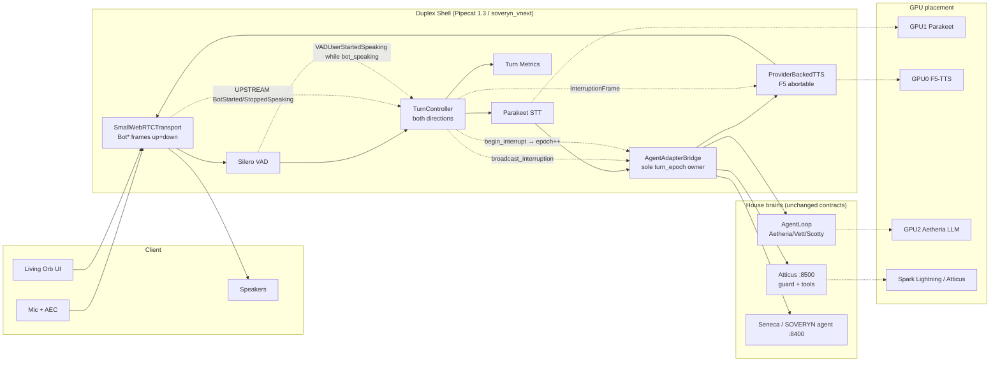
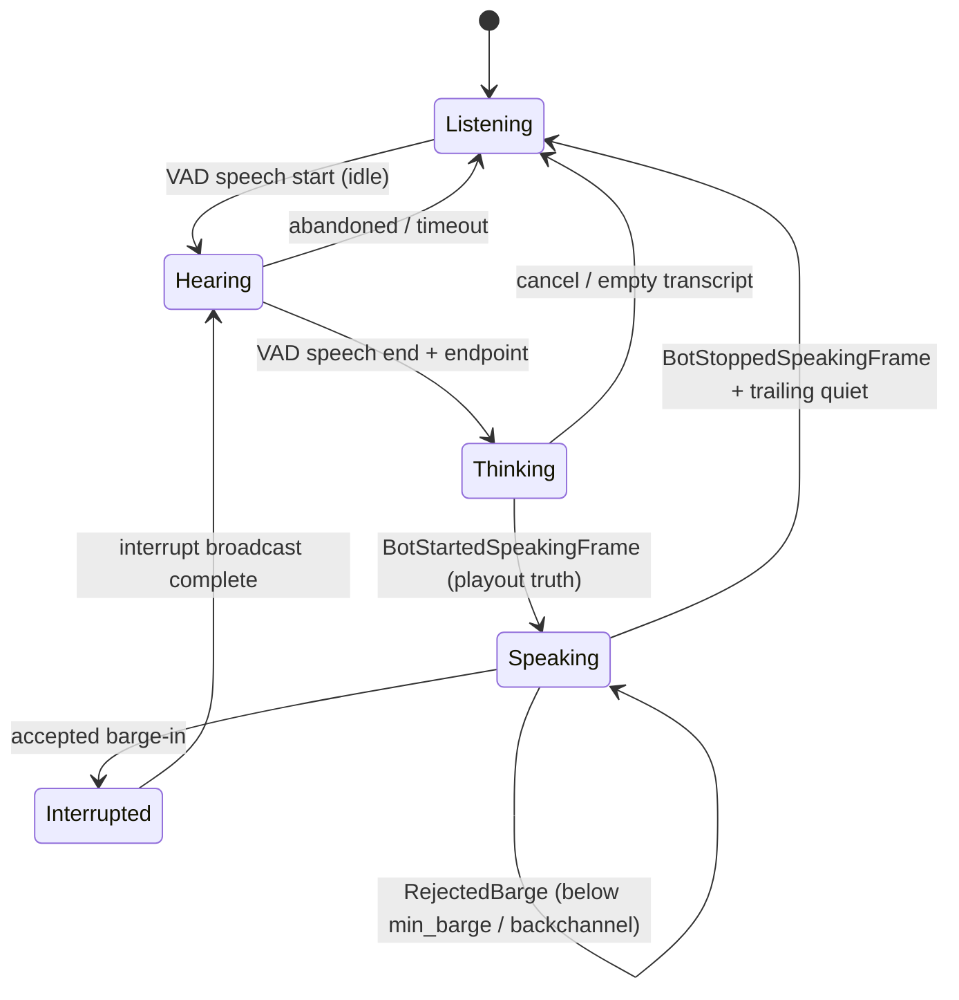
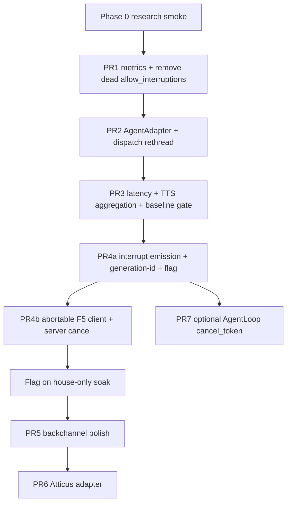

# House Duplex Voice Shell — Cascade Full-Duplex Runtime

| Field | Value |
|-------|--------|
| **Title** | SOVERYN / House Duplex Voice Shell (build-our-own full duplex) |
| **Author** | TBD (systems architecture) |
| **Date** | 2026-08-16 |
| **Status** | Draft — ready for review (rev 3: bot_speaking Bot\* frames + epoch owner) |
| **Primary repo** | `/home/jon-deoliveira/soveryn_vnext/` |
| **Related products** | Aetheria (SOVERYN voice UI), Atticus (History’s Ledger), Seneca / SOVERYN agent |
| **Pipecat baseline** | **1.3.0** (installed house env; verified 2026-08-16) |

---

## Overview

We need a **full-duplex conversational voice runtime** that bolts onto **any house LLM agent** (Aetheria / AgentLoop, Atticus, Seneca) without replacing those agents with an end-to-end speech LLM. NVIDIA NemotronLabs VoiceChat-11B demonstrates excellent turn-taking (~450 ms), barge-in, and live tool calling in a single fused model — but the released checkpoint is a **research-oriented black box**: fused encoder+LLM+decoder, single fixed voice (no house multi-voice cloning), and no clean path to preserve Atticus cite-or-stop / corpus gates or Aetheria’s lattice + persona stack.

This design proposes a **duplex shell** around the existing cascade:

```
mic → VAD → STT → AgentAdapter → TTS → speakers
         ↑____TurnController.broadcast_interruption()____|
```

Duplex is **infrastructure** (listen while speaking, emit real interruptions, cancel on barge-in, turn policy, streaming latency). Honesty, tools, memory, and corpus gates stay in the LLM agent. Voice identity stays **F5-TTS reference voices** per agent. VoiceChat-11B remains **Phase 0 research only** on an isolated GPU window — not the product brain.

**Rev 2–3 notes:** Pipecat 1.3.0 no longer honors `PipelineParams(allow_interruptions=…)`. Live barge-in requires an explicit emitter of `InterruptionFrame` via `FrameProcessor.broadcast_interruption()` (house `TurnController` and/or Pipecat `UserTurnProcessor` + `VADUserTurnStartStrategy`). The current pipeline only *handles* interruptions; it does not *emit* them on user speech mid-TTS. **`bot_speaking` for barge-in uses transport `BotStartedSpeakingFrame` / `BotStoppedSpeakingFrame` (upstream), not `TTSStartedFrame` / `TTSStoppedFrame`.** Sole `turn_epoch` owner is the adapter bridge.

---

## Background & Motivation

### Current house voice stack (verified 2026-08-16)

| Layer | Location | Port / surface | Notes |
|-------|----------|----------------|-------|
| Flask app | `soveryn/app/` | **:5001** | Voice blueprint registered from `startup._maybe_register_voice` |
| Signaling | `soveryn/app/routes/voice.py`, `voice_dispatch.py` | `POST /voice/<agent>/offer` | SmallWebRTC SDP offer → answer; dedicated asyncio loop per call |
| Pipeline | `soveryn/platform/voice/pipeline.py` | Pipecat **1.3.0** | `transport → VAD → ParakeetSTT → AgentLoopBridge → TTS → transport` |
| STT | `ParakeetSTTService` (SegmentedSTTService) | **:8087** `POST /transcribe` | VAD-bounded full-segment WAV → text; no streaming partials today |
| LLM | `AgentLoop.process_message_stream` | in-process | Sync generator → worker thread; emits `TTSTokenEvent`; **pipeline does not pass `source=` today** |
| TTS | `build_tts_service` → F5 primary | **:8088** `POST /synthesize` | Clause-framed WAV stream; voices `aetheria` / `vett` / `scotty`; **no server cancel** |
| Client | `soveryn/app/static/voice/voice_client.js` + `presence.js` | `/voice/<agent>` | Living orb; client-side amplitude state machine includes `INTERRUPTED` (UI only) |
| Agents with voice | `config.py` `VOICE_ENABLED_AGENTS` | aetheria, vett, scotty | F5 Phase 2 cutover 2026-06-15 |

### What actually exists for interruption (honest inventory)

| Piece | Status on house stack | Effect |
|-------|----------------------|--------|
| `AgentLoopBridge` handles `InterruptionFrame` → `_cancel_inflight()` | **Present** | Cancels asyncio drain of LLM tokens *if* frame arrives |
| New `TranscriptionFrame` → `_cancel_inflight()` then new turn | **Present** | Soft LLM cancel only **after** VAD endpoint + full STT — too late for mid-TTS barge-in UX |
| Pipecat `TTSService._handle_interruption` drops queued audio | **Present in framework** | Only runs when `InterruptionFrame` is processed |
| `PipelineParams(allow_interruptions=True)` in `pipeline.py` | **Dead code on 1.3.0** | Field **removed**; kwarg is **silently dropped** (`hasattr(p, "allow_interruptions") is False`). Params retain sample rates / heartbeats / metrics / metadata only |
| `UserTurnProcessor` / `LLMContextAggregatorPair` | **Absent** from house graph | In 1.3.0 these (or equivalent) are what typically call `broadcast_interruption()` on user-turn start when `enable_interruptions=True` |
| `VADProcessor` | **Present** | Emits `VADUserStartedSpeakingFrame` / `VADUserStoppedSpeakingFrame` only — **not** `InterruptionFrame` |
| Client `STATES.INTERRUPTED` | **Present** | Amplitude UI only; **does not stop server audio** |

**Implication:** Calling today’s path “barge-in ready” is false. Seeds = *handler + soft cancel + TTS interrupt path if framed*. Phase 2 must add an **emitter**.

### Remaining half-duplex / latency gaps

1. **STT waits for VAD stop** — `SegmentedSTTService` posts a complete WAV only after `VADUserStoppedSpeakingFrame` (current `stop_secs=0.3`). No interim transcripts.
2. **LLM cancel is soft** — `_cancel_inflight` cancels the asyncio drain task; the sync `process_message_stream` producer may still run until the next blocking I/O boundary (`pipeline.py` comments). User turn is saved **before** streaming; assistant / tools may still land after cancel unless generation-id drop + optional cooperative cancel land.
3. **F5 cancel is client-consumption only** — `F5TTSProvider` streams via httpx with no cancel token; `f5tts_service/server.py` loops all clauses with **no disconnect check**. Client `aclose` stops reading; **GPU may finish remaining clauses**.
4. **No house turn metrics export** — `enable_metrics=True` is set on the worker but does not feed `data/telemetry/`.
5. **Atticus is chat-only** — Spark **:8500** `POST /chat` (stdlib HTTP), non-streaming; honesty gates in `guard.py`. Response is `{reply, artifacts, captured}` only — **no `gate` field** (gate stays in audit log). Server does **not** load history by `session_id`; client must resend `messages`.
6. **VAD confidence is diagnostic** — live `VADParams(confidence=0.3, start_secs=0.1, stop_secs=0.3)` with comments that 0.3 is temporary; Silero default is ~0.7. Enabling interruptions on diagnostic VAD will thrash TTS.

### GPU layout (tower, measured 2026-08-16)

| GPU | Device | Free (approx) | House role (target layout) |
|-----|--------|---------------|----------------------------|
| 0 | Quadro RTX 8000 48 GB | ~31 GB free | Embeddings, F5-TTS (~1 GB), dense experiments |
| 1 | Quadro RTX 8000 48 GB | ~38 GB free | **Parakeet STT :8087**, Messie, display preferred |
| 2 | RTX PRO 5000 Blackwell 48 GB | ~18 GB free | **Aetheria face** (Gemma-4-31B ~30 GB) — do not co-tenant VoiceChat |

Spark: Lightning-30B MoE, Atticus, soveryn-agent, tunnels (`model_url` `http://10.10.10.2:8001`).

**VoiceChat-11B checkpoint:** `model.safetensors` = **44 382 749 892 bytes (~41.3 GiB; ~42 G as `ls -lh`)** at  
`/home/jon-deoliveira/models/NVIDIA-NemotronLabs-VoiceChat-11B` (also mirrored for Spark research).  
Runtime VRAM may differ from on-disk size (weights + KV + activations). That still does **not** leave room for Aetheria + Parakeet + F5 concurrent on one 48 GB card, and fused architecture cannot swap in Atticus/cite-or-stop. NVIDIA claims ~**448–480 ms** turn-taking / interruption latency on H100-class; multi-voice cloning is **not** available on this checkpoint.

### Why not productize VoiceChat as Atticus?

- Atticus product claim is **structural honesty** (`guard.py`), not “sounds natural.”
- Fused brain would invent outside corpus without the gate stack.
- Single fixed voice breaks house brand (multi-agent vocal identity is a locked sovereignty goal from `2026-06-10-sovereign-voice-design.md`).
- GPU budget conflicts with always-on face + STT + TTS.

---

## Goals & Non-Goals

### Goals

1. **Duplex shell** around existing STT + agent + TTS cascade; agents remain text brains.
2. **Phased path** from faster half-duplex → real barge-in (with real `InterruptionFrame` emission) → turn-policy polish → optional tiny turn head.
3. **First surfaces:** Aetheria voice UI (`/voice/aetheria`), then Atticus (History’s Ledger) with gates preserved.
4. **Realistic latency targets** for house cascade vs NVIDIA ~450 ms claim, gated on measured baselines.
5. **Transport:** SmallWebRTC first; optional WebSocket audio for non-browser clients.
6. **Agent adapter interface** so `AgentLoop` and Atticus `POST /chat` both plug in.
7. **Multi-voice** via F5 ref voices (`aetheria`, `vett`, `scotty`, future Atticus voice).
8. **Local-first security** — no audio egress by default; rate limits; session isolation.
9. **Turn observability** — STT, TTFT, TTS first audio, barge-in counts, F5 server waste.
10. **Incremental PRs** against `soveryn_vnext` voice pipeline first.

### Non-Goals

- Shipping VoiceChat-11B as production Atticus or Aetheria brain.
- Inventing facts, citations, or tool results in the duplex layer.
- Cloud STT/TTS as primary (ElevenLabs remains emergency fallback only).
- Replacing Pipecat / SmallWebRTC in Phase 1–2.
- Full continuous speech-to-speech neural duplex in-house (optional Phase 4 research).
- Guaranteeing NVIDIA-parity 450 ms on cascade without streaming ASR + hot LLM + short TTS clauses.
- Claiming `allow_interruptions=True` provides barge-in on Pipecat 1.3.0.

---

## Proposed Design

### Architecture doctrine

> **Duplex is a shell. Honesty is the agent. Voice identity is F5. Interruptions must be emitted, not hoped for.**



### Component map (build on existing files)

| Component | Existing anchor | Duplex change |
|-----------|-----------------|---------------|
| Transport | `SmallWebRTCTransport` in `pipeline.py` | Keep; optional WS ingress later |
| VAD | `SileroVADAnalyzer` + `VADProcessor` | Retune confidence before barge-in default-on; feed TurnController |
| **TurnController** | **Missing today** | New: process **both** frame directions; track `bot_speaking` from **Bot\*** frames; emit interruptions; min_barge; backchannel (Phase 3). Does **not** own `turn_epoch` |
| STT | `ParakeetSTTService` | Phase 1: faster segment; Phase 2: keep listening during TTS |
| Bridge | `AgentLoopBridge` | Generalize → adapter bridge; **sole owner of `turn_epoch`** + drop late frames |
| TTS | `ProviderBackedTTSService` / `F5TTSProvider` | Abortable client stream; optional server cooperative cancel |
| Session | `negotiate_and_dispatch_voice` | Pass adapter factory + metrics + duplex flags; drop dead ElevenLabs-required shape when F5 primary |
| Client | `voice_client.js` | Keep local orb states; optional server turn events later |

### Pipecat 1.3 interruption model (normative for Phase 2)

**Verified facts (house env, Pipecat 1.3.0):**

- `FrameProcessor.broadcast_interruption()` broadcasts `InterruptionFrame` upstream and downstream (`frame_processor.py`).
- `UserTurnProcessor` calls `broadcast_interruption()` on user-turn start when strategy params have `enable_interruptions=True` (`turns/user_turn_processor.py` ~194–195).
- `VADUserTurnStartStrategy` triggers on `VADUserStartedSpeakingFrame`.
- House pipeline has **neither** `UserTurnProcessor` nor any other emitter.

**Two acceptable implementations (pick one in PR4a; document choice in PR):**

| Option | Approach | Pros | Cons |
|--------|----------|------|------|
| **A (preferred for house)** | Custom `TurnController(FrameProcessor)` between VAD and STT that **handles both directions**: (1) **upstream** `BotStartedSpeakingFrame` / `BotStoppedSpeakingFrame` from `BaseOutputTransport` set `bot_speaking`; (2) **downstream** `VADUserStartedSpeakingFrame` while `bot_speaking` + flag → wait `min_barge_ms`, then `broadcast_interruption()` and call **bridge `begin_interrupt()`** (bridge bumps epoch). | Full control over min_barge / backchannel; correct playout-truth signal | House-owned code; must not ignore UPSTREAM frames |
| **B** | Insert Pipecat `UserTurnProcessor` with `VADUserTurnStartStrategy(enable_interruptions=…)` gated by env | Upstream-aligned interruption broadcast | Must not fight AgentLoop-owned context; still need **bot_speaking from Bot\*** so idle listening does not spam interruptions |

**Do not** reintroduce `PipelineParams(allow_interruptions=True)` — it is a no-op and misleads readers. Remove it from `pipeline.py` in PR1 or PR4a as drive-by cleanup.

### Turn controller (new)

Module: `soveryn/platform/voice/turn_policy.py` (pure policy) + processor wrapper in the same package or `turn_controller.py`.

**States (single barge-in path):**



| Decision | Phase | Mechanism |
|----------|-------|-----------|
| Endpoint user turn | 1 | Silero `stop_secs` (env-tunable; start from measured baseline) |
| Start agent turn | 1 | Final transcript |
| **Emit interruption** | **2** | `broadcast_interruption()` when accepted barge-in |
| Min barge speech | **2** | `min_barge_ms` (default **150 ms**) before accept; RejectedBarge stays in Speaking |
| Ignore backchannels | 3 | Short “uh-huh” / “yeah” under duration+energy while bot speaking |
| Echo / self-voice | 2 | Browser AEC (`echoCancellation: true`); retuned VAD confidence; optional ducking later |

**`bot_speaking` signal source (normative for PR4a):**

| Signal | Role | Direction seen by TurnController (between VAD and STT) |
|--------|------|--------------------------------------------------------|
| **`BotStartedSpeakingFrame`** | **Primary → `bot_speaking = true`** | **UPSTREAM** (and downstream) from `BaseOutputTransport` when outbound audio actually starts (`base_output.py` pushes sibling frames both ways) |
| **`BotStoppedSpeakingFrame`** | **Primary → `bot_speaking = false`** | **UPSTREAM** (and downstream) when outbound audio ends |
| `BotSpeakingFrame` | Optional keep-alive while still playing | UPSTREAM; do not require for boolean flag |
| `TTSStartedFrame` / `TTSStoppedFrame` | **Not primary for TC** | ControlFrames pushed **downstream from TTS only**. A TC **upstream of TTS never sees them** on the mic path. Useful only if a processor sits **after** TTS (we do not place TC there) |
| Bridge “turn started” / first `LLMTextFrame` | **Optional aspirational** pre-playout | May set `bot_pending=true` to suppress false idle barge if product wants; **playout-truth barge gate still requires Bot\*** |
| Client orb amplitude | UI only | **Not** authoritative for server cancel |

**Placement implication:** TurnController **must** implement `process_frame` for **both** `FrameDirection.DOWNSTREAM` (VAD / STT path) and **UPSTREAM** (Bot\* from transport.output). Ignoring direction → `bot_speaking` stuck false → barge-in never accepts under `SOVERYN_VOICE_BARGE_IN=1`.

### Generation-id / turn-epoch drop (Phase 2 exit criterion — not optional polish)

**Single owner: `AgentAdapterBridge` (the bridge).** No other component increments or compares epochs.

| Event | Who acts |
|-------|----------|
| New user transcript starts a turn | Bridge: `turn_epoch += 1`, tag producer + outgoing frames with new epoch |
| Accepted barge-in | TurnController: `broadcast_interruption()` then **`await bridge.begin_interrupt(reason=...)`** only — bridge alone does `turn_epoch += 1`, sets `cancel_event`, drops mismatched frames |
| Late `LLMTextFrame` / TTS chunk | Bridge (and TTS wrapper if tagged): drop if `frame.turn_epoch != bridge.current_epoch` |

- TC **must not** maintain a parallel epoch counter (avoids races and false drops).
- This is **required for Phase 2 exit** even if cooperative AgentLoop cancel (PR7) slips.
- Soft cancel alone is insufficient: late producer tokens must not re-open speech after interrupt.

**Conv_store semantics on interrupt:**

- User text may already be saved (`process_message_stream` saves user turn first).
- Interrupted turns may leave **user without assistant reply** — acceptable; do not invent a partial assistant save for voice.
- Optional later: mark turn `interrupted=true` in metadata if conv_store grows a field; not required for Phase 2.

### Agent adapter interface

New module: `soveryn/platform/voice/adapters/base.py`

```python
from collections.abc import AsyncIterator
from dataclasses import dataclass
from typing import Protocol, runtime_checkable
import asyncio

@dataclass(frozen=True)
class AgentTextChunk:
    text: str
    is_final: bool = False

@runtime_checkable
class AgentAdapter(Protocol):
    """Text brain behind the duplex shell. Never sees raw audio."""

    agent_id: str
    voice_id: str  # F5 registry key, e.g. "aetheria"
    supports_streaming: bool  # True: yield chunks as tokens; False: one shot then sentence-split

    def start_turn(
        self,
        *,
        session_id: str,
        user_text: str,
        cancel_event: asyncio.Event,
        turn_epoch: int,
    ) -> AsyncIterator[AgentTextChunk]:
        """Async generator of sanitized speakable text.

        Implementations: `async def start_turn(...): ... yield AgentTextChunk(...)`.
        Honor cancel_event between yields. Tag work with turn_epoch for drop checks.
        """
        ...

    async def on_cancelled(self, *, session_id: str, reason: str, turn_epoch: int) -> None:
        """Best-effort cleanup; must not invent user-visible content."""
        ...

    async def on_session_end(self, *, session_id: str) -> None:
        """WebRTC disconnect / pipeline teardown. Drop rolling history if adapter-owned."""
        ...
```

**Errors:** yield no speech on hard fail; optional single `AgentTextChunk` with a **fixed** local string only for transport failures (e.g. Atticus unreachable) — never model text that skipped gates. Prefer silence + metrics over invented filler.

**Metadata:** public Atticus API does not return `gate`. Do **not** require `AgentTurnResult.gate` until Atticus exposes it. Artifacts may be logged from Atticus JSON `artifacts` only; they are not spoken unless product later defines a read-back policy.

#### Adapter: AgentLoop (Aetheria / Vett / Scotty)

- Wrap existing bridge logic.
- Call `process_message_stream(session_id, user_text, source="voice")` — **assert in tests** (today pipeline omits `source=`).
- Map `TTSTokenEvent` → `AgentTextChunk`; `supports_streaming=True`.
- Cancel: `cancel_event` + cancel asyncio drain; generation-id drop on bridge; PR7 adds cooperative checks inside AgentLoop.

#### Adapter: Atticus

- HTTP client to `http://127.0.0.1:8500/chat` (tower SSH tunnel).
- Request: `{session_id, messages}` → response `{reply, artifacts, captured}` (and optional `fallback`).
- **Gates stay on Atticus** (`guard.check` before JSON reply). Speak **only** post-gate `reply`.
- `supports_streaming=False`: one HTTP round-trip, then shell sentence-splits for TTS.
- **Multi-turn history (normative):** Atticus does **not** load history server-side. The adapter owns a rolling `list[dict]` of `{role, content}` per `session_id` (WebRTC session lifetime), appends user + assistant after each successful turn, resends last N (Atticus already truncates to last 20 in `_sanitize`). On `on_session_end`, drop the list. Do **not** dual-write Atticus history into SOVERYN `conv_store` unless a later product decision wants unified ledger — default is adapter memory only for voice.
- **Rate limit:** Atticus `rate_limit_per_min` (default 20) keys on client IP / `X-Forwarded-For`. All tower→tunnel calls look like `127.0.0.1` → **shared bucket**. Mitigation options (open decision, pick in PR6): (1) raise limit for localhost on Atticus config for house, (2) send stable `X-Forwarded-For: voice-<session>` only if Atticus treats that as identity (today it does), (3) house-side throttle per session below Atticus cap. Document chosen approach in PR6.
- **Tool-wait UX:** default **silence** until post-gate reply (no invented “looking that up”). Orb stays in `thinking`. Optional canned phrase is product decision (Open Q).

#### Adapter: Seneca / SOVERYN agent

- Same shape as Atticus against `:8400`. Interface-only until Aetheria + Atticus ship.

### Pipeline factory evolution

```python
def build_voice_pipeline(
    *,
    adapter: AgentAdapter,
    session_id: str,
    webrtc_connection: SmallWebRTCConnection,
    parakeet_url: str = DEFAULT_PARAKEET_URL,
    duplex: DuplexConfig | None = None,
    metrics: TurnMetricsSink | None = None,
    # TTS selection remains inside build_tts_service; ElevenLabs key only if primary=elevenlabs
    elevenlabs_api_key: str | None = None,
    elevenlabs_voice_id: str | None = None,
    aiohttp_session: aiohttp.ClientSession | None = None,
) -> tuple[Pipeline, PipelineWorker]:
    ...
```

- `voice_id` for F5 comes from `adapter.voice_id`, not a parallel required ElevenLabs UUID when `SOVEREIGN_TTS_PRIMARY=f5tts`.
- Keep `build_aetheria_voice_pipeline` as a thin wrapper constructing `AgentLoopAdapter` for one release.
- `PipelineParams`: **drop** `allow_interruptions`; keep `enable_metrics=True` if useful for Pipecat internal metrics, but house truth is JSONL sink.

**Dispatch (`negotiate_and_dispatch_voice` / `run_aetheria_voice_session`):**

- Thread `adapter` (or adapter factory + agent_name) through dispatch in **PR2**.
- Make `elevenlabs_api_key` / ElevenLabs voice id **optional** when F5 is primary (matches `startup._maybe_register_voice` F5 path).
- Messenger + `/voice/session/<id>/offer` must keep working; checklist item on every pipeline PR.

### Barge-in sequence (Phase 2)

```mermaid
sequenceDiagram
  participant U as User
  participant VAD as Silero VAD
  participant TC as TurnController
  participant STT as Parakeet
  participant AD as AdapterBridge
  participant TTS as F5 client+server
  participant RTC as WebRTC out

  TTS->>RTC: TTSAudioRawFrame (downstream)
  RTC-->>TC: BotStartedSpeakingFrame (UPSTREAM)
  Note over TC: bot_speaking=true (playout truth)
  U->>VAD: speech while bot_speaking
  VAD->>TC: VADUserStartedSpeakingFrame (downstream)
  TC->>TC: wait min_barge_ms (default 150)
  alt rejected (noise / too short / backchannel Phase3)
    TC->>TC: stay Speaking
  else accepted barge-in
    TC->>TC: broadcast_interruption()
    TC->>AD: begin_interrupt(reason=barge_in)
    Note over AD: sole owner: turn_epoch++ , cancel_event, drop late frames
    TC->>TTS: InterruptionFrame path / aclose stream
    Note over TTS: playout stops; server may still finish in-flight clause
    RTC-->>TC: BotStoppedSpeakingFrame (UPSTREAM)
    Note over TC: bot_speaking=false; state Interrupted → Hearing
  end
  U->>VAD: speech end
  VAD->>STT: segment WAV
  STT->>AD: transcript
  Note over AD: turn_epoch++ for new turn; tag producer
  AD->>TTS: new synthesize
  TTS->>RTC: first audio
  RTC-->>TC: BotStartedSpeakingFrame (UPSTREAM)
```

**Hard requirements for “real” barge-in (Phase 2 exit):**

1. VAD remains armed during TTS (`audio_in` never muted).
2. TurnController sees **UPSTREAM `BotStartedSpeakingFrame` / `BotStoppedSpeakingFrame`** so `bot_speaking` is playout-true.
3. **Emitter** calls `broadcast_interruption()` on accepted barge-in (not `allow_interruptions`).
4. **Bridge-owned `turn_epoch` drop** so late frames never reach speakers (`begin_interrupt` / new-turn only on bridge).
5. TTS client aborts HTTP stream + drops buffered PCM (`httpx` response `aclose`).
6. **Optional but planned:** F5 server cooperative cancel between clauses — see F5 section.
7. Outbound WebRTC / Pipecat TTS queue flushed via interruption handling.
8. Client orb may show `interrupted`; UI is not sufficient alone.

### F5 cancel semantics (client vs server)

| Layer | What cancel does | What it does **not** do |
|-------|------------------|-------------------------|
| **Playout path** (required Phase 2) | Stop emitting PCM to WebRTC; drop queues; `aclose` client stream | Guarantee GPU idle |
| **F5 server** (PR4b target) | Between clauses, check client disconnect / cancel flag and break loop | Kill mid-mel inference instantly without process support |
| **Metric** | `f5_clauses_completed_after_cancel` | — |

**Perceived barge-in stop** is a **playout-path** metric (see Latency). Do not claim “F5 job dead in 300 ms.”

### Streaming latency path (Phase 1)

| Stage | Current | Phase 1 target behavior |
|-------|---------|-------------------------|
| STT | Full segment after silence | Keep segment STT; tune `stop_secs` from **measured** baseline |
| LLM | Token stream via `TTSTokenEvent` | Already streaming; bridge flush at sentence / ~40 chars |
| TTS aggregation | Pipecat default **`TextAggregationMode.SENTENCE`** | **PR3 must set explicitly**: prefer `TOKEN` for lower first-audio **or** keep SENTENCE but document double-buffer cost vs bridge flush; no silent default |
| F5 | Clause-level frames (~700 ms first clause claimed in service comments) | Prefer short first clause; pre-warm model |

Critical path:

\[
T_{\text{first}} \approx T_{\text{endpoint}} + T_{\text{STT}} + T_{\text{LLM-TTFT}} + T_{\text{agg}} + T_{\text{TTS-first-clause}} + T_{\text{jitter}}
\]

**Warm Aetheria** definition: face model already loaded on Blackwell; not cold process start; first voice turn after at least one prior chat/voice turn in-process preferred for p50 tables.

### Phase plan

| Phase | Name | Deliverable | Exit criteria |
|-------|------|-------------|---------------|
| **0** | VoiceChat smoke (research) | Offline script on isolated GPU; no product wiring | Sample WAV → audio/text out; document VRAM + latency; never on :5001 |
| **1** | Faster half-duplex | Metrics, adapter interface, aggregation mode choice, `source="voice"`, baseline publish | PR1 baseline numbers published; Phase 1 E2E gate met **or** explicit “missed — new OKR” in PR3 |
| **2** | Real barge-in | TurnController/UserTurnProcessor emitter, generation-id drop, abortable F5 client, flag | Accepted barge-in stops **playout** within target; late frames never spoken; false-barge soak recorded |
| **3** | Turn-policy polish | Backchannel ignore; further VAD hysteresis | False barge-in rate acceptable in live soak |
| **4** | Optional turn head | Tiny classifier offline | Only if Phase 3 plateaus |

### Phase 0 constraints (VoiceChat)

- Checkpoint: `/home/jon-deoliveira/models/NVIDIA-NemotronLabs-VoiceChat-11B` (~41.3 GiB weights file)
- Code: NVIDIA-NeMo/Speech `nemotron-labs-voicechat` branch
- Run **offline** inference only for research; interactive container optional on a **scheduled** Quadro free window — **never GPU2 / Blackwell face**
- Output: notes under `docs/notes/` — not a production feature flag

---

## API / Interface Changes

### Unchanged browser contract (Phase 1)

```
GET  /voice
GET  /voice/<agent>
POST /voice/<agent>/offer     body: {sdp, type} → {sdp, type, pc_id}
GET  /voice/agents            localhost
POST /voice/session/<id>/offer  localhost, binds existing chat session
```

### DuplexConfig

```python
@dataclass(frozen=True)
class DuplexConfig:
    barge_in: bool = False           # Phase 2 flag SOVERYN_VOICE_BARGE_IN
    stop_secs: float = 0.3           # VAD endpoint silence
    start_secs: float = 0.1
    confidence: float = 0.7          # Phase 2 default; override diagnostic 0.3
    min_volume: float = 0.6
    min_barge_ms: int = 150          # hysteresis before accept (PR4a)
    backchannel_max_ms: int = 600    # Phase 3
    metrics_enabled: bool = True
```

| Env | Default | Meaning |
|-----|---------|---------|
| `SOVERYN_VOICE_BARGE_IN` | `0` | Enable interruption emission + cancel path |
| `SOVERYN_VOICE_METRICS` | `1` | Emit turn metrics JSONL |
| `SOVERYN_VOICE_STOP_SECS` | `0.3` | VAD endpoint silence |
| `SOVERYN_VOICE_VAD_CONFIDENCE` | `0.7` | Silero confidence (do not leave 0.3 when barge-in on) |
| `SOVERYN_VOICE_MIN_BARGE_MS` | `150` | Min speech before accepted barge-in |
| `SOVERYN_VOICE_ADAPTER` | `agent_loop` | `agent_loop` \| `atticus` \| `http` |
| `SOVERYN_VOICE_TTS_AGG` | `token` | `token` \| `sentence` → `TextAggregationMode` |

### Optional WebSocket (Phase 2+)

```
WS /voice/<agent>/ws
  → client: binary PCM 16 kHz mono + JSON control
  ← server: binary PCM 24 kHz mono + JSON turn events
```

Not required for Aetheria orb.

### Atticus voice surface (PR6)

- Tower hosts WebRTC + STT + TTS + `AtticusAdapter`
- Atticus remains text API on `:8500`; gates unchanged
- `SUPPORTED_AGENTS` / messenger allowlists updated only when F5 voice `atticus` exists
- Duplex flags shared with messenger via same env / `DuplexConfig` construction in dispatch (Open Q: confirm messenger wants barge-in on by default — default **same env**, off until soak)

---

## Data Model Changes

| Store | Change |
|-------|--------|
| `conv_store` (AgentLoop agents) | No schema change; pass `source="voice"`; interrupted turns may lack assistant reply |
| Atticus voice history | **Adapter-owned** rolling `messages` for session lifetime — not Atticus server state |
| Metrics | `data/telemetry/voice_turns.jsonl` (or telemetry.db) |
| Atticus audit | Unchanged `conversations.log`; gate only there |
| Audio retention | **Default off** |

### Metrics record (per turn / barge event)

```json
{
  "ts": "2026-08-16T12:00:00Z",
  "agent": "aetheria",
  "session_id": "...",
  "turn_id": "...",
  "turn_epoch": 3,
  "stt_ms": 180,
  "llm_ttft_ms": 420,
  "tts_first_audio_ms": 650,
  "e2e_first_audio_ms": 2100,
  "barge_in": true,
  "barge_accept_to_playout_stop_ms": 180,
  "barge_vad_start_to_playout_stop_ms": 330,
  "f5_clauses_completed_after_cancel": 1,
  "cancel_reason": "barge_in",
  "user_chars": 42,
  "assistant_chars_spoken": 40,
  "adapter": "agent_loop",
  "warm": true
}
```

---

## Latency targets

NVIDIA VoiceChat: ~**450 ms** smooth turn-taking / ~**480 ms** interruption (H100, fused). House cascade will not match without streaming ASR + always-hot TTFT + short first clause.

### Baseline gate (mandatory after PR1)

Before locking Phase 1 OKRs, PR1 must publish **measured** warm-Aetheria p50/p95 for:

- endpoint silence used
- `stt_ms`, `llm_ttft_ms`, `tts_first_audio_ms`, `e2e_first_audio_ms`

Treat table below as **initial OKRs**, not contracts, until baseline exists. PR3 merge requires either meeting the gate or updating this doc with new numbers + rationale.

### Stage budgets (planning only; p50(sum) ≠ sum(p50))

| Stage | Planning p50 | Notes |
|-------|--------------|-------|
| Endpoint silence | 250–350 ms | VAD `stop_secs` |
| STT ≤3 s audio | 200–400 ms | Segment Parakeet |
| LLM TTFT warm | 300–600 ms | Face model loaded |
| Text aggregation | 0–300 ms | TOKEN ≈0 extra; SENTENCE can add |
| TTS first clause | 600–900 ms | F5 comments ~700 ms |
| WebRTC jitter / playout | 50–150 ms | Often ignored in lab sums |

**Arithmetic floor** often lands **~1.6–2.4 s** before variance. That is why Phase 1 targets below are raised vs rev 1.

### Targets

| Metric | Phase 1 (half-duplex polish) | Phase 2 (barge-in) | NVIDIA reference |
|--------|------------------------------|--------------------|------------------|
| Endpoint silence | 250–350 ms | 200–300 ms | n/a |
| STT segment | ≤ 300 ms p50 / 500 ms p95 | same | fused |
| LLM TTFT warm | ≤ 500 ms p50 | ≤ 500 ms p50 | fused |
| TTS first clause | ≤ 800 ms p50 | ≤ 700 ms p50 stretch | fused |
| **E2E first audio** (user stop → hear bot) | **≤ 2.2 s p50 / 3.2 s p95** (stretch OKR ≤2.0 s) | **≤ 2.0 s p50** stretch if aggregation+clause win; else hold 2.2 s | **~0.45 s** |
| **Barge-in stop (policy-accept → last audible sample)** | n/a | **≤ 350 ms p95** | ~0.48 s class |
| **Barge-in stop (VAD start → last audible)** | n/a | **≤ 500 ms p95** (includes `min_barge_ms`) | — |
| False barge-in | n/a | log rate; flag off until soak | — |

**Definitions:**

- **`barge_accept_to_playout_stop_ms`**: clock starts when TurnController accepts barge-in (after `min_barge_ms`), ends when last bot PCM is abandoned / not played. **This is the 350 ms p95 target.**
- **`barge_vad_start_to_playout_stop_ms`**: includes hysteresis; expect ≈ accept metric + `min_barge_ms` (+ VAD start_secs). Target **≤ 500 ms p95** with `min_barge_ms=150`.
- Residual browser audio element drain may add tens of ms; measure on wire if possible, else mark “perceived.”

**Atticus voice:** E2E first audio **≤ 3.0 s p50** Phase 1 (non-stream + tools); honesty &gt; speed.

**Rev 1 1.5 s / 1.8 s cascade first-audio targets are retired** as default gates; they remain stretch OKRs only after baseline proves stage budgets allow.

---

## Alternatives Considered

### (A) Productize VoiceChat-11B black box

| Pros | Cons |
|------|------|
| Best open FD latency demos | Single fixed voice |
| Tool-calling while speaking | Fused LLM ≠ Atticus gates / Aetheria lattice |
| One process | ~41+ GiB weights; conflicts with face + STT + TTS |
| | Cannot bolt honesty rails after decode |

**Verdict:** Phase 0 research only.

### (B) Cascade duplex shell (chosen)

| Pros | Cons |
|------|------|
| Reuses Parakeet, F5 multi-voice, AgentLoop, Atticus gates | Higher floor latency than fused ~450 ms |
| Incremental PRs on known path | Must implement real interruption emission |
| Multi-GPU split matches house | Soft cancel + F5 server waste need work |

**Verdict:** **Chosen.**

### (C) Wait for NVIDIA bolt-on / multi-voice runtime

Unknown timeline; do not block Phases 1–3.

### (D) LiveKit / full media SFU

Rejected earlier for single-user house; SmallWebRTC remains correct.

---

## Security & Privacy Considerations

| Threat | Severity | Mitigation |
|--------|----------|------------|
| Audio leaving house | High | Local STT/TTS default; ElevenLabs only if explicit primary |
| Session cross-talk | High | One pipeline + session_id per WebRTC connection |
| Public offer abuse | Medium | Localhost gates where present; rate limit offer |
| Atticus gate bypass via voice | Critical | Only speak post-gate `/chat` `reply` |
| Shared rate-limit bucket via tunnel | Medium | PR6 chooses localhost raise / per-session identity |
| Prompt injection via STT | Medium | Transcript = untrusted user text |
| Debug audio retention | Medium | Off by default |
| STUN to Google | Low | Document; optional house STUN |

---

## Observability

### Logs

- `soveryn.voice.turn`, `soveryn.voice.barge`, `soveryn.voice.adapter`, `soveryn.voice.f5_cancel`

### Metrics

| Metric | Type | Labels |
|--------|------|--------|
| `voice_stt_ms` | histogram | agent, adapter |
| `voice_llm_ttft_ms` | histogram | agent, adapter |
| `voice_tts_first_audio_ms` | histogram | agent, voice_id |
| `voice_e2e_first_audio_ms` | histogram | agent, warm |
| `voice_barge_accept_to_stop_ms` | histogram | agent |
| `voice_barge_vad_to_stop_ms` | histogram | agent |
| `voice_barge_in_total` | counter | agent, accepted |
| `voice_f5_clauses_after_cancel` | counter | agent |
| `voice_cancel_total` | counter | agent, reason |
| `voice_sessions_active` | gauge | agent |

### Alerting (ops-light)

- p95 e2e first audio &gt; 5 s for 15 min (raised with honest budgets)
- Parakeet or F5 error rate &gt; 5%
- Barge-in cancel storms

---

## Rollout Plan



| Step | Flag / action | Rollback |
|------|---------------|----------|
| Phase 1 | Metrics on; no barge flag | Revert PR |
| Phase 2 | `SOVERYN_VOICE_BARGE_IN=1` after soak readiness | Set `0` — emitter no-ops |
| TTS | `SOVEREIGN_TTS_PRIMARY=f5tts` | `elevenlabs` |
| Atticus | PR6 after PR4a minimum | Unregister adapter |

---

## Risks

| Risk | Severity | Mitigation |
|------|----------|------------|
| No interruption emission (rev1 false seed) | Critical | PR4a TurnController / UserTurnProcessor |
| Soft cancel + late TTS after barge-in | High | Generation-id drop required Phase 2 |
| F5 GPU continues after client cancel | Medium | Server cooperative cancel PR4b; metric waste |
| False barge-in with confidence=0.3 | High | Restore confidence ≥0.7 before flag default-on; min_barge_ms=150 |
| Optimistic E2E targets | Medium | Baseline gate; 2.2 s Phase 1 |
| Atticus shared rate limit | Medium | PR6 identity plan |
| Scope creep into speech LLM product | High | Non-goals |

---

## Open Questions

1. **Atticus F5 voice source** — who records reference audio; register/accent?
2. **Cooperative cancel in AgentLoop** — PR7 `cancel_token` depth vs generation-id only?
3. **Streaming Parakeet** — partial hypotheses available, or segment-only through Phase 2?
4. **Canned tool-wait speech** — silence-only vs fixed house string for long Atticus tools?
5. **WebSocket transport** — needed for non-browser client in 90 days?
6. **Phase 0 owner / GPU calendar** — when can a Quadro be drained?
7. **Interruption implementation** — house `TurnController` (A) vs Pipecat `UserTurnProcessor` (B)? Owner: voice PR4a author.
8. **Atticus multi-turn ownership** — confirm adapter-only rolling messages (default in this doc) vs also mirror into SOVERYN conv_store?
9. **F5 server cancel** — cooperative disconnect between clauses vs new single-clause endpoint first?
10. **Barge-in metric for product OKRs** — primarily `accept→stop` (recommended) or `vad_start→stop` for marketing comparison to NVIDIA?
11. **Messenger / PWA duplex flags** — same `SOVERYN_VOICE_BARGE_IN` as orb, or messenger stays half-duplex longer?
12. **Atticus rate-limit identity** through SSH tunnel — localhost raise vs synthetic `X-Forwarded-For` per session?

---

## References

- Sovereign voice design: `docs/superpowers/specs/2026-06-10-sovereign-voice-design.md`
- Pipecat spike (pre-1.3 interruption notes; partially obsolete): `docs/superpowers/notes/2026-06-10-pipecat-spike.md`
- Compute layout: `docs/notes/2026-08-14-target-compute-layout.md`
- Pipeline: `soveryn/platform/voice/pipeline.py`
- Dispatch: `soveryn/app/routes/voice_dispatch.py`
- Routes: `soveryn/app/routes/voice.py`
- TTS: `soveryn/platform/voice/sovereign_tts.py`, `providers/f5tts.py`; server `~/f5tts_service/server.py`
- Agent stream: `soveryn/agents/loop.py`
- Atticus: `~/atticus/server.py`, `guard.py`, `model_client.py`
- Pipecat 1.3: `pipecat.turns.user_turn_processor.UserTurnProcessor`, `FrameProcessor.broadcast_interruption`, `TextAggregationMode`
- NVIDIA checkpoint: `/home/jon-deoliveira/models/NVIDIA-NemotronLabs-VoiceChat-11B`
- NVIDIA code: https://github.com/NVIDIA-NeMo/Speech/tree/nemotron-labs-voicechat

---

## Key Decisions

| # | Decision | Rationale |
|---|----------|-----------|
| 1 | **Cascade duplex shell, not VoiceChat product brain** | Multi-voice F5, Atticus gates, AgentLoop/lattice; VoiceChat fused + single voice + large weights |
| 2 | **Interruptions via explicit `broadcast_interruption()` (TurnController and/or UserTurnProcessor), not `allow_interruptions`** | Pipecat 1.3.0 dropped the param; house graph has no emitter today |
| 2b | **`bot_speaking` = transport Bot\* frames (upstream), not TTSStarted/Stopped** | TC sits before TTS; only Bot\* travel UPSTREAM from `transport.output` |
| 3 | **AgentAdapter protocol in front of all brains** | One shell, many agents |
| 4 | **Bridge is sole `turn_epoch` owner; drop is Phase 2 exit, not PR7-only** | Single writer avoids races; late frames after soft cancel are product bugs |
| 5 | **Phases 0→4; barge-in split PR4a/PR4b** | Emit+drop first; F5 abort second |
| 6 | **Aetheria first, Atticus second; PR6 needs PR4a** | Bad barge UX on second product surface is unacceptable |
| 7 | **F5 remains voice identity; client abort required; server cancel tracked** | Playout stop ≠ GPU idle |
| 8 | **Honest latency: Phase 1 ≤2.2 s p50 E2E; barge accept→stop ≤350 ms p95; baseline gate after PR1** | Rev1 1.5–1.8 s was optimistic vs stage sum |
| 9 | **Atticus history is adapter-owned rolling messages** | Server has no session transcript store |
| 10 | **Local-first audio; metrics mandatory** | Tune policy with data |

---

## PR Plan

Ordered train. Checklist on every voice PR: messenger `negotiate_and_dispatch_voice` still works; `SUPPORTED_AGENTS` only extended intentionally.

### PR1 — Voice metrics + DuplexConfig + dead-param cleanup

| Field | Content |
|-------|---------|
| **Title** | `voice: turn metrics sink + DuplexConfig; drop allow_interruptions no-op` |
| **Depends on** | — |
| **Files** | `soveryn/platform/voice/metrics.py` (new), `config.py`, `pipeline.py` (instrument timestamps; remove `allow_interruptions=`), tests |
| **Description** | JSONL turn metrics. Env `SOVERYN_VOICE_METRICS`. **Publish baseline p50/p95** for warm Aetheria in PR description (or follow-up note within 48 h of merge). No barge-in behavior change. |

### PR2 — AgentAdapter + dispatch rethread

| Field | Content |
|-------|---------|
| **Title** | `voice: AgentAdapter protocol; extract bridge; optional ElevenLabs params` |
| **Depends on** | PR1 |
| **Files** | `adapters/base.py`, `adapters/agent_loop.py`, `pipeline.py`, `voice_dispatch.py`, `voice.py` startup wiring, tests |
| **Description** | `build_voice_pipeline(adapter=...)`. F5 path does not require ElevenLabs key. Pass **`source="voice"`** into `process_message_stream` (assert in tests). Keep `build_aetheria_voice_pipeline` wrapper. Messenger path green. |

### PR3 — Faster half-duplex (Phase 1)

| Field | Content |
|-------|---------|
| **Title** | `voice: Phase 1 latency — TTS aggregation mode + first-clause path` |
| **Depends on** | PR1 baselines published, PR2 |
| **Files** | `sovereign_tts.py` / `build_tts_service` (`TextAggregationMode` from `SOVERYN_VOICE_TTS_AGG`), adapter flush rules, VAD env knobs, docs update if OKRs miss |
| **Description** | Explicit TOKEN vs SENTENCE. Target E2E first audio **≤ 2.2 s p50** warm Aetheria (stretch ≤2.0 s). If miss, update Latency section rather than merge-fail silently. |

### PR4a — Interruption emission + generation-id (Phase 2 core)

| Field | Content |
|-------|---------|
| **Title** | `voice: barge-in emitter + turn_epoch drop under SOVERYN_VOICE_BARGE_IN` |
| **Depends on** | PR2 |
| **Files** | `turn_controller.py` / `turn_policy.py`, `pipeline.py`, adapter bridge (`begin_interrupt` / sole `turn_epoch`), VAD confidence defaults, tests |
| **Description** | TC processes **both directions**: UPSTREAM `BotStartedSpeakingFrame`/`BotStoppedSpeakingFrame` set `bot_speaking`; downstream VAD start while bot speaking + flag → min_barge → `broadcast_interruption()` + **`bridge.begin_interrupt()`** (bridge alone does epoch++). Tests inject **Bot\*** frames (or real output playout), not only `TTSStartedFrame`. Default `min_barge_ms=150`. VAD confidence **0.7** when flag on. Flag default **off**. Exit: late frames never spoken; accept→playout_stop instrumented. |

### PR4b — Abortable F5 client + server cooperative cancel

| Field | Content |
|-------|---------|
| **Title** | `voice/f5: abort client stream + inter-clause cancel on disconnect` |
| **Depends on** | PR4a |
| **Files** | `providers/f5tts.py`, `sovereign_tts.py`, `~/f5tts_service/server.py` (or companion PR), metrics `f5_clauses_completed_after_cancel` |
| **Description** | Client `aclose` + drop PCM. Server: between clauses, if client gone, break. Document playout stop vs GPU idle. |

### PR5 — Turn-policy polish (Phase 3)

| Field | Content |
|-------|---------|
| **Title** | `voice: backchannel ignore + false-barge soak knobs` |
| **Depends on** | PR4a (PR4b preferred) |
| **Files** | `turn_policy.py`, config, tests |
| **Description** | Backchannel max duration; soak metrics. Min barge already in PR4a. |

### PR6 — Atticus adapter

| Field | Content |
|-------|---------|
| **Title** | `voice: AtticusAdapter + rolling messages + rate-limit plan` |
| **Depends on** | **PR4a minimum** (PR4b preferred); PR2 |
| **Files** | `adapters/atticus.py`, routes allowlist, F5 voice note, tests with mocked `:8500` |
| **Description** | HTTP `/chat` only post-gate `reply`. Adapter-owned history. Document rate-limit identity choice. No duplex-side facts. |

### PR7 — (Optional) Cooperative cancel in AgentLoop

| Field | Content |
|-------|---------|
| **Title** | `agents: cancel_token for process_message_stream` |
| **Depends on** | PR4a |
| **Files** | `soveryn/agents/loop.py`, voice adapter, tests |
| **Description** | Harder cancel than epoch drop alone; reduces tool side effects after barge-in. |

### PR8 — (Optional) Phase 0 research notes

| Field | Content |
|-------|---------|
| **Title** | `docs: VoiceChat-11B offline smoke notes (research)` |
| **Depends on** | — (parallel) |
| **Files** | `docs/notes/…`, `scratch/` scripts |
| **Description** | Isolated GPU; no production route. |

### Out of scope for initial PR train

- Phase 4 turn head training  
- Replacing Parakeet with VoiceChat encoder  
- Cloud STT  
- LiveKit migration  

---

## Appendix A — Current pipeline skeleton (as-is)

```
SmallWebRTCTransport.input()
  → VADProcessor(SileroVADAnalyzer)   # confidence=0.3 diagnostic today
  → ParakeetSTTService                # SegmentedSTTService
  → AgentLoopBridge                   # handles InterruptionFrame; does not emit it
  → ProviderBackedTTSService          # F5 :8088; TextAggregationMode.SENTENCE default
  → SmallWebRTCTransport.output()
```

`PipelineParams(allow_interruptions=True, …)` — **kwarg ignored on Pipecat 1.3.0**.

**Target Phase 2 skeleton:**

```
transport.input()
  → VADProcessor
  → TurnController
       # DOWNSTREAM: VAD user speech → barge policy
       # UPSTREAM:   BotStarted/StoppedSpeakingFrame from transport.output → bot_speaking
       # on accept:  broadcast_interruption() + bridge.begin_interrupt()
  → ParakeetSTTService
  → AgentAdapterBridge  # SOLE turn_epoch owner; drop late frames
  → ProviderBackedTTSService  # abortable; aggregation mode explicit
  → transport.output()  # emits Bot* upstream+downstream when audio plays
```

## Appendix B — Port cheat sheet

| Service | Host | Port |
|---------|------|------|
| SOVERYN vnext | tower | 5001 |
| Parakeet STT | tower | 8087 |
| F5-TTS | tower | 8088 |
| Atticus | Spark (tunnel) | 8500 |
| SOVERYN agent / Seneca | Spark (tunnel) | 8400 |
| Lightning model | Spark | 8001 |

## Appendix C — Why multi-GPU cascade fits the house

Per `2026-08-14-target-compute-layout.md`:

- **Blackwell:** Aetheria chat only  
- **Quadro:** Parakeet + F5 + embeds  
- **Spark:** Atticus + Lightning  

Duplex shell is orchestration on CPU/RAM (:5001) with audio models on Quadros — **not** a ~41 GiB fused tenant on the face GPU.

## Appendix D — Pipecat 1.3 quick citations

- `PipelineParams`: no `allow_interruptions` field (pydantic model; extra kwargs dropped).
- `FrameProcessor.broadcast_interruption()` → `broadcast_frame(InterruptionFrame)`.
- `UserTurnProcessor._on_user_turn_started`: if `params.enable_interruptions: await self.broadcast_interruption()`.
- `VADUserTurnStartStrategy`: triggers on `VADUserStartedSpeakingFrame`.
- `TTSService` default `TextAggregationMode.SENTENCE`; set `TOKEN` for lower latency streaming into TTS.
- **`BotStartedSpeakingFrame` / `BotStoppedSpeakingFrame` / `BotSpeakingFrame`**: SystemFrames; docstrings state emitted **upstream and downstream** by `BaseOutputTransport` when bot audio starts/stops/continues (`transports/base_output.py` pushes sibling pairs both directions).
- **`TTSStartedFrame` / `TTSStoppedFrame`**: ControlFrames from TTS **downstream only** — not visible to a TurnController placed before TTS unless re-broadcast (house does not re-broadcast).
