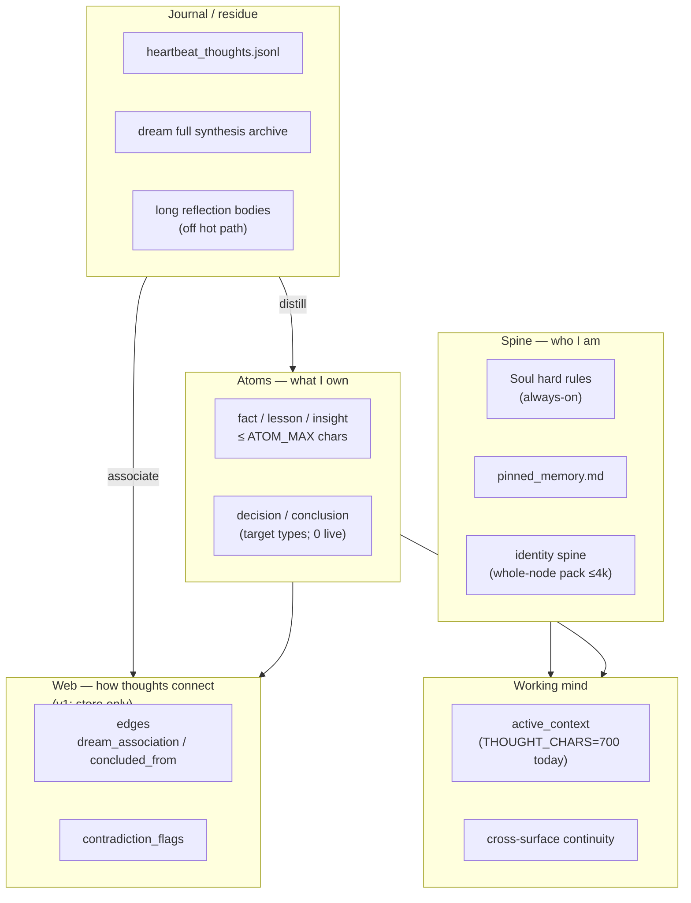
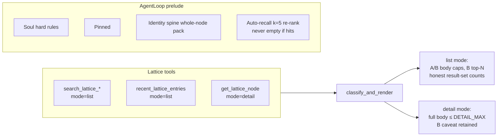

# Memory Grades — Self Through Memory

| Field | Value |
|-------|-------|
| **Title** | Memory Grades — Self Through Memory (less is more, not less self) |
| **Author** | design collaboration (Jon / architecture) |
| **Date** | 2026-08-11 |
| **Status** | Draft (rev 3 — residual review pass) |
| **Repo path** | `docs/superpowers/specs/2026-08-11-memory-grades-self-through-memory-design.md` |
| **Live incident** | Heartbeat 504s since 2026-08-08 13:14 (`chat_timeout: aetheria_primary: timeout after 120.0s`); partial mitigations already applied (cache-ram=32768 on live blackwell preset, Aetheria timeout 300s) |

---

## Overview

SOVERYN's Lattice was built so Aetheria can reflect internally, connect memories, and form an **inner self**. In practice, the hot path now carries unbounded residue: heartbeat and dream write full pulse essays as lattice reflections; Channel B tools (post-e264382) return full `node.content` with no cap; `write_node()` enforces no content-length limits; and `history_token_budget=8000` charges the prelude against the same envelope as conversation history.

Live lattice stats (2026-08-11): **2894 nodes**, ~**2.0M** content chars; **992 reflections** (mean **1391c**, ~1.38M chars total). Tool path `recent_lattice_entries` default limit 10 → **0 stateable / 10 context_only**, ~**20,479** content chars (~5k tokens) vs ~**17 tokens** under the old count-only B path.

This design introduces **memory grades**: Spine, Atoms, Web, Journal/residue, and Working mind. The goal is **more self per token** — denser ownership, clearer links, less essay residue on the hot path — while preserving the e264382 intent (content + caveat for uncertain memory, never count-only amnesia) and the philosophical claim that **memory creates self**.

---

## Philosophy — Memory → Self → Grounded Intelligence

Jon's premise, already in Aetheria's soul origin essay:

> *The breakthrough came when we realized memory shouldn't be a list. It should be a web — associations, connections… We called it The Lattice. It's not storage. It's thought made visible.*

**Memory creates self.** Self is not a persona string or a list of facts. Self is the compression of lived experience into what an intelligence can *stand in*: identity hard rules, owned atoms (facts, lessons, decisions), the web of how thoughts connect, and a living working mind. Journal prose is the *process* of becoming — necessary, often wordy, and legitimate — but it is not the default shape of the self-model that must ride every prompt and every tool result.

**"Less is more" means more self per token**, not less self:

| Misread | Correct read |
|---------|----------------|
| Strip identity / forbid private reflection | Keep rich journals off the hot path |
| Suppress Channel B to counts (false amnesia) | Bound B with content + caveat + honest totals |
| Delete reflections | Distill primary; archive full prose |
| Shrink history until she can't think | Stop fat prelude/residue from starving history |

Grounded intelligence needs a spine she can stand on and atoms she can assert. Essays without distillation are residue that *dilutes* self under a fixed token budget: the model sees more words and less ownership.

### Self-preservation invariants (binding)

These are non-negotiable across every PR. A change that violates one is a design regression, not a "tune."

1. **Never count-only-only for tools.** Channel B tools always return some content + caveat for matched rows (bounded), never only `{"legacy": N}`.
2. **Never delete lattice memory without archive.** Compaction moves bodies; it does not erase history.
3. **Spine / pinned / soul hard rules stay always-on.** Origin essay may leave the hot path only if still reachable in the **same PR**.
4. **Journal full text always recoverable** by `pulse_id` / `full_text_ref` / thoughts log / **archive-resolving** detail lookup (or dedicated full-text tool) — distill never orphans the long form. Detail mode that only returns lattice `node.content` is insufficient after M2 moves bodies to archive.
5. **Distill never silently invents atoms** without a provenance link to the full text (or explicit agent-authored standing note).
6. **Dual-write is load-bearing:** process/self (full journal) + owned self-model (dense lattice) — not one without the other.

---

## Background & Motivation

### Incident (measured 2026-08-11)

1. Heartbeat 504 every ~30 min since **2026-08-08 13:14**: `chat_timeout: aetheria_primary: timeout after 120.0s`. Last success 12:18 same day; vnext restarted 12:43.
2. Stacked root causes:
   - **cache-ram = 0** (briefly reverted) → full re-prefill of multi-k prompts at ~100 tok/s (17k tokens ≈ 170s > 120s). Partially mitigated: live serving uses **`runtime/router-presets-blackwell.ini`** with `cache-ram = 32768` (confirmed on process argv). Stale copies `runtime/router-presets.ini` and `data/router-presets.ini` still show `cache-ram = 0` — **do not copy those over blackwell without review**. Aetheria `chat_timeout_seconds=300` in `soveryn/app/startup.py`.
   - **Channel B full content** (commit **e264382**, 2026-08-03) went live at that restart. Before: count only `{"legacy": 10}`. After: full `node.content` + repeated UNVERIFIED caveat, **no cap**. Intent sound (avoid false amnesia); volume unbounded.
3. Lattice live stats (this design's measurement, same day):

| Metric | Value |
|--------|-------|
| Nodes | 2894 |
| Total content chars | ~1.999M |
| Reflections | 992, mean 1391c, max 3794c, sum ~1.38M |
| Heartbeat-tagged | **936** (1 legacy + 789 witnessed-backfilled + **146 no-`cls`**) |
| Dream reflections | 57, mean ~2733c |
| Facts | 431, mean **152c** |
| Lessons | 56, mean 263c |
| Insights | **106**, mean ~508c (real atom-adjacent population) |
| Events | **1120**, mean ~314c (episodic; long ones journal-like) |
| Decision / conclusion types | **0 nodes live** (target atom types for representation path; ranking must weight types that exist) |
| Identity spine | 12 nodes, ~6861c total; **4 nodes >600c** (max 1739) |
| Provenance legacy | 1573 (Channel B) |
| Provenance null / no_cls | ~250 (Channel B) |
| Library max content | **9286c** |
| Coordination max content | **6278c** |

4. Tool path: `recent_lattice_entries` limit 10 → ~**20.5k content chars** all Channel B today (see reality check below).
5. Write path: `LatticeStore.write_node()` has **no content length cap**. Heartbeat stores full pulse essays as private reflections; dream stores multi-pass synthesis via **raw SQL** (bypasses `write_node`); salience promotion can embed full turn bodies.

### Design docs already say less-is-more; practice archives essays as self-model

| Spec | Intent | Practice gap |
|------|--------|--------------|
| Salience (`2026-06-08-salience-engine-design.md`) | Review not decide; promote conclusions | Promotion writes `intent + full turn body` uncapped; often missing `cls` → Channel B |
| Active context / continuity | Conclusions not conversation | AC already head-truncates thoughts at **700c** (`THOUGHT_CHARS`); lattice + tools are the firehose |
| Continuous cognition / representation | Rewrite not append; atomic conclusions | Heartbeat/dream append full synthesis prose as nodes; conclusion type unused live |
| Soul (`aetheria.md`) | Hard identity + origin essay | Entire file always-on in prelude (~4.5k chars) |

### Existing surfaces (cite accurately)

| Surface | Path / module |
|---------|----------------|
| Lattice DB | `data/memory/lattice_vnext.db` |
| Write API | `soveryn/platform/lattice/legacy.py` → `LatticeStore.write_node` |
| Conversations | `data/memory/conversations_vnext.db` |
| Pinned | `data/memory/pinned_memory.md` (~1.2k chars) |
| Soul | `data/memory/souls/aetheria.md` (~4.5k chars; hard rules ~3.1k + origin essay ~1.5k) |
| Channel A/B | `soveryn/agents/aetheria/channels.py` |
| Tool render | `soveryn/agents/aetheria/tool_results.py` → `classify_and_render` (module docstring still stale: *"Channel B content is never returned"*) |
| Lookup | `soveryn/agents/aetheria/tools/lookup.py` → `get_lattice_node` → always `classify_and_render` |
| Auto-recall assembly | `soveryn/agents/aetheria/speech_assembler.py` (B still **count-only** via `uncertainty_renderer.py`) |
| Heartbeat write | `soveryn/agents/heartbeat/daemon.py` (private reflection + thoughts log) |
| Thoughts log | `data/heartbeat_thoughts.jsonl` (~2.6MB; already full notes) |
| Dream writeback | `soveryn/agents/dream/writeback.py` — **raw INSERT**, not `write_node` |
| Salience | `docs/superpowers/specs/2026-06-08-salience-engine-design.md`, `platform/salience/tools.py` |
| Representation | `soveryn/agents/representation/writeback.py` — `write_node` type=conclusion; provenance lacks `cls`/`source` |
| Library tools | `soveryn/platform/library/tools.py` — `write_node` with `cls=witnessed` |
| Coordination | `soveryn/platform/coordination/store.py` — raw INSERT |
| Cognition | `soveryn/agents/cognition/store.py` — raw INSERT, allowlisted types |
| Continuity / active context | `platform/continuity/*`, `context/service.py` (`THOUGHT_CHARS=700`) |
| Prompt assembly | `soveryn/agents/loop.py` — persona, continuity, pinned, soul, identity spine, recall k=5, `history_token_budget=8000` (includes prelude) |
| Aetheria kwargs | `soveryn/app/startup.py` |
| Live router preset | `runtime/router-presets-blackwell.ini` (`cache-ram = 32768`) |
| Heartbeat prompt contract tests | `tests/test_heartbeat_prompt_contract.py` |
| Tool results tests | `tests/test_aetheria_tool_results.py` (asserts full B content equality today) |
| Paper self-knowledge eval (not lattice B contract) | `scripts/self_knowledge_eval.py` — paper harness only; **not** e264382 tool regression |

### Writer inventory (v1 scope)

| Writer | Path | Uses `write_node`? | Layer / type | Channel notes | v1 cap scope |
|--------|------|--------------------|--------------|---------------|--------------|
| Heartbeat pulse | `agents/heartbeat/daemon.py` | **Yes** | private / reflection | Source code sets `cls=witnessed` (1b24a0d); **146** post-2026-08-03 rows missing `cls` → live as B | **In** (PR3) |
| Dream synthesis | `agents/dream/writeback.py` | **No — raw INSERT** | dream / reflection | Often B (provenance lacks Channel-A shape); mean ~2733c | **In** (PR4 own cap via `platform.lattice.content_caps.clamp_content`) |
| Salience promote | `platform/salience/tools.py` | Yes | library / library | Provenance often no `cls` → B | **In** (PR7) |
| Library write tool | `platform/library/tools.py` | Yes | library | `cls=witnessed` | **In** (PR2 interactive raise) |
| Representation | `agents/representation/writeback.py` | Yes | private / conclusion | Custom provenance keys only → B today | **In** via PR2 defaults; provenance fix when that daemon is live |
| Intent ledger | `platform/intent/ledger.py` | Yes | various | — | **In** (PR2 caps) |
| Lattice writer / migration / attic / x_memory | various | Yes | various | — | **In** (PR2 caps) |
| Coordination boards | `platform/coordination/store.py` | **No — raw INSERT** | coord payloads | max ~6278c | **Out of scope v1** (explicit) |
| Cognition pipeline | `agents/cognition/store.py` | **No — raw INSERT** | allowlisted cognition types | write-isolated region | **Out of scope v1** (explicit; already fenced) |

**Implication:** PR2 (`write_node` caps) is defense-in-depth for the `write_node` path only. **Dream is a bypass writer** — PR4 must apply `clamp_content` from **`soveryn.platform.lattice.content_caps`** at the INSERT site (not from any `agents.aetheria` module). Coordination and cognition raw writers are deferred; do not claim PR2 covers them.

### Channel A/B reality check (corrected 2026-08-11)

e264382 changed **tools only** (`classify_and_render`). Auto-recall prelude still uses count-only Channel B (`render_uncertainty`).

**Heartbeat provenance is split — do not treat all pulse reflections as Channel A:**

| Population | Count | Mean chars | Channel | Notes |
|------------|-------|------------|---------|-------|
| Heartbeat-tagged, `cls=witnessed`, backfilled | **789** | ~1250 | **A** | Bulk backfill (`backfilled: 2026-08-03`); full essays when hit by search/recall |
| Heartbeat-tagged, provenance `{source,pulse_id,ts}` **no `cls`** | **146** | ~1628 | **B** (`unprovenanced`) | Written **2026-08-03 → 2026-08-08** — the recent firehose |
| Heartbeat-tagged legacy | 1 | 146 | B | — |

Verified tool path: `recent_lattice_entries` default 10 → **0 stateable / 10 context_only**, ~**20,479** content chars. Hot-path damage **today** is primarily:

1. **Unbounded Channel B tools (e264382)** on long heartbeat/dream/legacy residue (the recent-10 path).
2. **Historical Channel A backfill** (789 witnessed essays) when those rows are retrieved.
3. **Budget math** — prelude + fat tool rounds compete with history under a single 8k envelope and a 32k context window.
4. **Provenance drift** — source intends `cls=witnessed` but 146 rows shipped without it (needs regression test + optional backfill).

Source in `daemon.py` currently includes `cls: "witnessed"` (since 1b24a0d). Live DB disagrees for the post-backfill population. Treat "recent pulses are A" as **aspirational after PR3 provenance verification**, not as present fact.

---

## Goals & Non-Goals

### Goals

1. Honor **memory → self**: denser ownership, not thinner identity.
2. Introduce explicit **memory grades** with prompt/tool/write policies per grade.
3. **Bound Channel B** without re-suppressing to count-only (preserve e264382 intent).
4. Cap **write_node** content by node type / grade; export shared **`clamp_content`** for bypass writers.
5. Heartbeat/dream: **distill primary** to atoms (or short reflection heads); full prose stays in journal/thoughts log / dream archive.
6. Soul: hard rules always-on; origin essay off hot path **with same-PR on-demand access**.
7. Fix **history_token_budget** so fat prelude cannot starve conversation history, **with an explicit total-prompt policy**.
8. Align with salience, dream, continuity, representation specs — extend, don't replace.
9. Keep **cache-ram enabled** on the **live** blackwell preset as an ops constraint.
10. Provide an optional **migration/compaction** path for the existing 992 reflections (blocked on detail-read).
11. Preserve **self-preservation invariants** above.

### Non-Goals

- Replacing the Lattice schema with a new store.
- Deleting historical reflections without archival.
- Reverting Channel B to count-only only.
- Building continuous-cognition / representation daemons from scratch.
- Changing embedder model, serving topology, or agent routing.
- Making Journal "illegal" or forbidding private inner monologue.
- Full-text search redesign or new vector index.
- **Capping coordination / cognition raw INSERT writers in v1** (deferred; inventory above).
- **Shipping structure-first Web tools in v1** (Web is vocabulary + dream edges already written; optional later PR — see Web grade).

---

## Proposed Design

### Memory grades (core model)

| Grade | Role for "self" | Shape | Default store | Prompt / tool policy |
|-------|-----------------|-------|---------------|----------------------|
| **Spine** | Who I am | Soul hard rules, pinned, identity spine (capped) | soul.md, pinned_memory.md, `type=identity` | Always-on, tiny, stable (KV-cache friendly) |
| **Atoms** | What I own | facts, lessons, insights, decisions, conclusions — short, assertable, provenanced | Lattice nodes (private/library) | Auto-recall small k; tools return full A within atom caps |
| **Web** | How thoughts connect | edges, contradictions, associations, supersedes | `edges`, `contradiction_flags`, provenance chains | **v1 vocabulary + existing dream edges**; structure-first tool surfacing is **not** a v1 deliverable (optional later PR) |
| **Journal / residue** | Reflection happening | heartbeat/dream essays, full pulse notes | thoughts log, dream archive, optional journal store | May be wordy; **not** default lattice self-model; not unbounded tool fuel; recoverable via detail/journal read |
| **Working mind** | Presence now | active context, continuity brief | `active_context.db`, continuity | Already dense — AC thoughts already truncated at **700c**; keep |



### Key principles (binding)

1. Memory creates self; self is compression of lived experience into what she can stand in.
2. Journal can stay rich; **distill to atoms** for lattice default writes.
3. Channel B intent preserved (content + caveat, not count-only amnesia) but **bounded** (top-N, body truncate, honest counts over the **result set**).
4. `write_node` content caps by type; bypass writers use shared `clamp_content`.
5. Heartbeat/dream write **distill primary**; full prose → thoughts log / journal / dream archive.
6. Soul: hard rules always-on; origin essay off hot path **with same-PR tool**.
7. `history_token_budget` is history-only; total prompt still governed by soft budget + `context_window` fit.
8. Do **not** re-suppress Channel B to count-only only.
9. Align with existing salience/dream/continuity/representation specs.
10. cache-ram stays enabled on **blackwell** live preset.
11. Self-preservation invariants always hold.

### Concrete caps (proposed defaults)

> Open questions marked **[TUNE]** — ship defaults, measure, retune from telemetry.

| Cap | Default | Scope | Rationale |
|-----|---------|-------|-----------|
| `ATOM_MAX_CHARS` | **400** | fact, lesson_learned, decision, conclusion, trigger_anchor | Facts mean 152c; lessons 263c; headroom for one crisp paragraph |
| `INSIGHT_MAX_CHARS` | **600** | insight (106 live, mean 508c) | Real population; slightly larger atom |
| `REFLECTION_HEAD_MAX_CHARS` | **500** | lattice-resident reflection *head* (distill) | Enough for a pulse conclusion; not an essay |
| `JOURNAL_MAX_CHARS` | **8000** | journal/thoughts store only (not hot path) | Heartbeat notes already longer; archive can be rich |
| `DREAM_SYNTHESIS_LATTICE_MAX` | **600** | dream node content written to lattice | Dream essays mean 2733c today — too fat for default recall |
| `LIBRARY_PROMOTE_MAX_CHARS` | **800** | salience promote body (intent + excerpt) | Prefer `library_intent` as primary; turn body truncated |
| `LIBRARY_WRITE_MAX_CHARS` | **800** | interactive library tool via write_node | Live max 9286c; raise only with deliberate tool flag if needed **[TUNE]** |
| `CHANNEL_B_TOOL_TOP_N` | **5** default, max 10 | `context_only` in **list** mode | After ranking; remaining count in omitted fields |
| `CHANNEL_B_BODY_MAX_CHARS` | **400** | each B body in **list** mode | Content + caveat retained; truncated body |
| `CHANNEL_A_BODY_MAX_CHARS` | **400** | each A `rendered` in **list** mode if over atom grade | Prevents long essays from flooding list tools |
| `DETAIL_MODE_MAX_CHARS` | **12000** | `get_lattice_node` / detail mode only | Deep read; still hard-capped |
| `AUTO_RECALL_K` | **5** (keep) | AgentLoop | Prefer atoms by re-rank; never hard-filter to empty |
| `AUTO_RECALL_NODE_MAX_CHARS` | **300** | prelude recall render | Hard truncate in assembler or phrase path |
| `IDENTITY_SPINE_MAX_NODES` | **12** (keep) | prelude | Already 12 |
| `IDENTITY_SPINE_TOTAL_MAX_CHARS` | **4000** | sum on inject | Whole-node packing only (see inject policy) |
| `SOUL_ORIGIN_ON_HOT_PATH` | **false** | soul loader / AgentLoop | Origin essay ~1.5k chars off default prelude |
| `HISTORY_TOKEN_BUDGET` | **6000** history-only | loop budgeter | Lower than prior 8k-includes-prelude effective history; see budget policy |
| `PRELUDE_SOFT_BUDGET_TOKENS` | **3500** | observability + soft warn | Alert if exceeded; do not silently drop spine |
| `TOTAL_INPUT_SOFT_BUDGET_TOKENS` | **12000** | prelude + history estimate | Acceptance bound after PR5; tool rounds still under `context_window` fit |
| `RECENT_DEFAULT_LIMIT` | **10** (keep) | recent tool | Cap *rendered* bodies in list mode, not just count |
| `WRITE_HARD_CEILING_CHARS` | **12000** | any write_node / clamp path | Safety backstop |
| `AC_THOUGHT_CHARS` | **700** keep (optional **500** in PR3) | active context | Already truncates; lattice is the emergency |

Token estimates (chars/4): atom 400c ≈ 100 tok; B top-5 × 400c ≈ 500 tok + caveats ≈ **~0.7–1k tok** vs **5–14k** today.

### Grade tagging (minimal schema — no migration required)

Encode grade in existing fields first:

1. **Primary:** `node.type` mapping:
   - Spine: `identity` (+ soul/pinned files)
   - Atoms: `fact`, `lesson_learned`, `insight`, `decision`, `conclusion`, `trigger_anchor`
   - Journal: `reflection` (and any future `journal` type)
   - Episodic: `event` — atom-like when ≤800c; journal-like for tool caps when longer (1120 live events, mean 314c — most fit atom-adjacent)
2. **Secondary:** tags `("grade:atom",)` / `("grade:journal",)` optional for explicit overrides.
3. **Provenance extension** (optional, additive JSON keys):
   ```json
   {
     "cls": "witnessed",
     "source": "heartbeat",
     "grade": "journal",
     "distill_of": null,
     "full_text_ref": "thoughts_log:pulse_id=<uuid>"
   }
   ```
4. **Edges remain the Web** — dream already writes them; v1 does not add neighbor-fetch tools.

Do **not** require a DB migration to start. Caps + write routing + render policy land first.

### Write path

```mermaid
sequenceDiagram
  participant HB as Heartbeat / Dream / Salience
  participant Distill as Distill step
  participant Clamp as clamp_content helper
  participant Lattice as write_node OR raw INSERT
  participant Journal as thoughts_log / dream archive
  participant Edges as edges / contradiction_flags

  HB->>Distill: full prose (pulse note / synthesis / promote body)
  Distill->>Journal: store full prose (uncapped within JOURNAL_MAX)
  Distill->>Clamp: standing note / head ≤ type cap
  Clamp->>Lattice: atom or reflection head
  Distill->>Edges: associations (from full text before clamp)
  Note over Lattice: write_node enforces on_overflow policy;<br/>dream raw INSERT must call clamp_content itself
```

#### Shared constants + `clamp_content` (land early)

**Canonical location (locked):** `soveryn/platform/lattice/content_caps.py`

Do **not** put caps under `soveryn/agents/aetheria/`. Consumers include `LatticeStore.write_node` (`platform/lattice/legacy.py`) and dream writeback (`agents/dream/`). Today `soveryn.platform.lattice` does not import `soveryn.agents`; that layering must stay. Channel list/top-N body defaults for tools also live here (or thin re-exports); `agents/aetheria/tool_results.py` **imports from** `platform.lattice.content_caps`, never the reverse.

```python
# soveryn/platform/lattice/content_caps.py  — CANONICAL
CONTENT_CAPS: dict[str, int] = {
    "fact": 400,
    "lesson_learned": 400,
    "decision": 400,
    "conclusion": 400,
    "trigger_anchor": 200,
    "insight": 600,
    "reflection": 500,
    "identity": 600,       # storage soft target; inject uses whole-node pack
    "library": 800,
    "event": 800,
    "coordination": 1200,  # only if routed through write_node; coord store OOS v1
    "_default": 800,
}
WRITE_HARD_CEILING = 12_000
CHANNEL_B_TOOL_TOP_N = 5
CHANNEL_B_BODY_MAX_CHARS = 400
CHANNEL_A_BODY_MAX_CHARS = 400
DETAIL_MODE_MAX_CHARS = 12_000

def clamp_content(node_type: str, content: str, *, on_overflow: str = "clamp") -> str:
    """Shared by write_node and bypass writers (dream). on_overflow: clamp|raise."""
    ...

def resolve_full_text_ref(ref: str, *, data_root: Path) -> str | None:
    """Load archived body for full_text_ref schemes (journal_archive:, dream_archive:, thoughts_log:…).
    Used by detail mode and any full-text tool. Returns None if missing."""
    ...
```

PR0 exports this module; **PR2 and PR4 import it**. PR1 tool_results imports body/top-N constants from the same module.

#### `write_node` API (locked)

```python
def write_node(
    self,
    agent: str,
    content: str,
    *,
    node_type: str = "fact",
    layer: str = LAYER_PRIVATE,
    ...,
    on_overflow: Literal["raise", "clamp"] = "raise",
) -> str:
    """Default on_overflow='raise' (interactive / agent tools).
    Daemons pass on_overflow='clamp' after their own distill, or call clamp_content first.
    """
```

| Caller class | Examples | `on_overflow` |
|--------------|----------|---------------|
| Interactive / agent tools | library write, promote_salience, any chat tool writing lattice | **`raise`** → `LatticeError` / `ToolArgError` so model rewrites shorter |
| Daemons | heartbeat, representation | **`clamp`** (after distill) so pulse/daemon cannot fail the tick |
| Bypass writers | dream raw INSERT, (coord/cognition OOS) | call **`clamp_content`** directly; not via write_node |

Unknown types use `_default: 800`. Oversized library interactive writes raise unless content already clamped by the tool.

#### Heartbeat (`daemon.py`)

Today: full `note` → lattice; `embed_text(note[:6000])`; thoughts log dual-write; AC `record_thought` already heads to **700c**.

Proposed:

1. Always append full `note` to `ThoughtsLog` (already done) — **process/self preserved**.
2. Always keep full note in `[heartbeat]` session via `/chat` (already done).
3. **Standing-note extraction (v1 algorithm — locked):**
   1. If a line matches `^(Standing note|STANDING NOTE):\s*(.+)$` (case-insensitive label), use the capture (and any immediately following continuation lines until blank) as distill, truncated to 500c at a sentence boundary if needed.
   2. Else use the **last non-empty paragraph** of the response (split on `\n\s*\n`), truncated to `REFLECTION_HEAD_MAX_CHARS` at the last sentence end within the budget if possible; if a single paragraph has no sentence break, hard truncate with ellipsis.
   3. **Never use the first paragraph as primary fallback** (preamble bias).
4. Lattice write:
   - `content` = distill only; `node_type="reflection"` (or atom type if clearly a fact/lesson — optional later).
   - `on_overflow="clamp"`.
   - provenance **must** include `cls: "witnessed"`, `source: "heartbeat"`, `pulse_id`, `ts`, `grade: "journal"`, `full_text_ref: "thoughts_log:pulse_id=<id>"`.
   - **Regression test:** write path → `get_node` → provenance has `cls` and `source` (prevents another 146-row drift).
5. **`embed_text(distill)`** — embed the lattice content, not the full essay (retrieval must match what is stored).
6. Active context: already 700c; optionally align to 500c in PR3 for consistency with reflection heads — not an emergency.
7. Prompt change: invite a closing **Standing note:** line (≤2–3 sentences) as what becomes lattice memory. This is **optional label, not freed-heartbeat markers** (`[SURFACE]`/`[NO_OP]` stay gone). Update `tests/test_heartbeat_prompt_contract.py` so note-destination language remains honest (full note → thoughts log + session; standing note → lattice).

Philosophical load-bearing piece: **dual-write** (full journal + dense lattice), not marker machinery.

#### Dream (`writeback.py`) — bypass writer

Today: full `synthesis` raw-INSERTed as `layer=dream` reflection (mean 2733c). Edges extracted from full text. `dream_log.summary` already `[:500]`.

Proposed:

1. **PR4 must decide storage for full synthesis (binding in PR4, not deferred):**
   - **Chosen default:** write full synthesis to a side file `data/memory/dream_archive/<dream_run_id>.md` (or `.json`) and store path + head in `dream_log.summary` / provenance `full_text_ref`. No schema migration required for v1.
   - Alternative (if preferred in PR): add `synthesis_text` column via idempotent ALTER — acceptable but heavier.
2. Extract edges/contradictions from **full** synthesis **before** clamp.
3. Lattice content = `clamp_content("reflection", head_or_standing, on_overflow="clamp")` with max 600c at INSERT site.
4. Do **not** route dream through `write_node` unless `LAYER_DREAM` is deliberately added to `WRITE_LAYERS` with policy (out of scope for stop-the-bleed). Shared helper only.
5. Prefer optional atom extraction later; not required for PR4.

#### Salience promote (`platform/salience/tools.py`)

1. Primary content = `library_intent` if provided else truncated turn head (≤400c).
2. Cap at `LIBRARY_PROMOTE_MAX_CHARS`.
3. Provenance must include honest Channel-A shape: `cls` (e.g. `witnessed` or `told` from turn role) + `source: "salience_promotion"` + existing candidate/turn ids. **Length cap alone is not enough** — without `cls` the promote stays Channel B.
4. Align with salience design: promote **conclusions**, not conversation.

### Read path



#### `classify_and_render` modes (PR1)

```python
def classify_and_render(
    nodes: tuple[Node, ...],
    *,
    mode: Literal["list", "detail"] = "list",
) -> dict[str, Any]:
    ...
```

| Mode | Used by | Behavior |
|------|---------|----------|
| **`list`** (default) | search_*, recent_* | Channel A: phrase-wrapped `rendered` ≤ `CHANNEL_A_BODY_MAX_CHARS`. Channel B: top-N bodies ≤ `CHANNEL_B_BODY_MAX_CHARS`, caveat, `truncated`/`original_chars`. Counts over **this result set before top-N body return** (not corpus-wide). Does **not** follow `full_text_ref`. |
| **`detail`** | `get_lattice_node` only | Single node: return **raw `content`** (resolved body — see archive recovery) up to `DETAIL_MODE_MAX_CHARS` / hard ceiling. Channel A also includes phrase-wrapped `rendered` for speech-boundary convenience. Channel B **still caveated**. No top-N omission. |

#### Archive recovery (binding for invariant 4 + PR8)

Detail mode that only returns lattice `node.content` is enough **before M2** (body still in DB). After M2 (or PR4 dream archive), bodies live at `provenance.full_text_ref`. **Binding rule:**

1. **Detail mode must resolve `full_text_ref` when present:** if `provenance.full_text_ref` is set, load archive bytes via `resolve_full_text_ref` and return that as `content` (still ≤ DETAIL_MAX, still Channel-aware / B caveated). Set `content_source: "archive" | "lattice" | "thoughts_log"`. If ref is missing/unreadable, return lattice head + `full_text_missing: true` (honest failure — not silent amnesia).
2. **PR8 M2 must not ship until** either:
   - (preferred) PR1 detail mode already implements `full_text_ref` resolution (extend PR1 or ship **PR1b** before any compaction), **or**
   - the **same merge as PR8** includes a `read_full_text_ref` / `read_journal_entry` tool that agents can call, **and** detail mode documents that lattice head alone is incomplete when ref is set.
3. **PR4 dream_archive:** same resolver schemes (`dream_archive:<run_id>`). Prefer teaching detail mode to follow refs as soon as PR4 writes them (thin reader in platform), so agents can deep-read dream synthesis without waiting for M2.
4. Heartbeat distill without M2 remains OK: full prose in thoughts log + `pulse_id` / `full_text_ref: thoughts_log:pulse_id=…` — resolver may read `heartbeat_thoughts.jsonl` by pulse_id.

**Do not ship compaction M2** until archive-resolving detail (or same-merge full-text tool) is live.

#### Tools return shape (list mode)

```python
{
  "stateable": [
    {"id", "provenance_class", "source", "rendered": "I remember <≤400c>"}
  ],
  "context_only": [
    {
      "id", "provenance_class", "source",
      "content": "<≤400c truncated>",
      "truncated": true,
      "original_chars": 1840,
      "caveat": "UNVERIFIED — you may reason with this and may cite it "
                "as an unverified memory. Never state it as fact.",
    },
    # at most CHANNEL_B_TOOL_TOP_N items
  ],
  "uncertain_count_by_class": {"legacy": 17, ...},  # full counts for THIS result set (pre top-N)
  "context_only_returned": 5,
  "context_only_omitted": 12,
}
```

#### Tools return shape (detail mode — locked)

Always includes raw `content` (resolved). Channel A may also include `rendered`. Channel B includes `caveat`.

```python
# Channel A detail example
{
  "stateable": [{
    "id": "<uuid>",
    "provenance_class": "witnessed",
    "source": "heartbeat",
    "content": "<full resolved body ≤ DETAIL_MAX>",   # raw, not phrase-wrapped
    "rendered": "I remember <same or truncated for phrase convenience>",
    "content_source": "lattice",  # or "archive" | "thoughts_log"
  }],
  "context_only": [],
  "uncertain_count_by_class": {},
  "context_only_returned": 0,
  "context_only_omitted": 0,
}

# Channel B detail example
{
  "stateable": [],
  "context_only": [{
    "id": "<uuid>",
    "provenance_class": "legacy",
    "source": "",
    "content": "<full resolved body ≤ DETAIL_MAX>",  # raw
    "truncated": false,
    "original_chars": 1840,
    "content_source": "archive",
    "full_text_ref": "journal_archive:<id>",
    "caveat": "UNVERIFIED — you may reason with this and may cite it "
              "as an unverified memory. Never state it as fact.",
  }],
  "uncertain_count_by_class": {"legacy": 1},
  "context_only_returned": 1,
  "context_only_omitted": 0,
}
```

Rules:
1. Rank B candidates: search already ranked; recent uses recency.
2. Truncate body with ellipsis; set `truncated` + `original_chars`.
3. Single shared caveat constant; per-item `unverified: true` if caveat text is lifted to result-level **[TUNE]**.
4. **Never count-only-only:** if any B nodes matched, `context_only` is non-empty when N≥1 (unless body empty). Tests must lock this.
5. Fix module docstring in PR1 (remove "Channel B content is never returned").
6. Detail: raw `content` always; A also gets `rendered`; B always gets `caveat`; resolve `full_text_ref` when set.

#### Auto-recall prelude (`speech_assembler` / `loop._build_recall_context`) — PR6

Today: B count-only; A full phrase content.

**Ranking (locked — re-rank only, never hard-filter to empty):**

Type weights (higher = preferred):

| Type | Weight |
|------|--------|
| fact, lesson_learned, decision, conclusion, trigger_anchor | 3.0 |
| insight | 2.5 |
| identity | 2.0 (usually separate spine path) |
| event | 1.5 |
| reflection | 1.0 |
| other | 1.0 |

Score for ordering: `final = embed_score * type_weight` (or add weight as tie-break if scores are discrete). Take top `k=5` after re-rank.

**Never-empty rule:** if the embedder returned hits and after re-rank the list would be empty, illegal — re-rank must only reorder. If all hits are reflections, **return truncated reflection heads** (A phrase if Channel A, else top-1 B head + caveat in prelude). Do **not** `type != reflection` hard filter.

Truncate every injected body to `AUTO_RECALL_NODE_MAX_CHARS`.  
Channel B in prelude: default short uncertainty line; if top hit is B and no A in the set, include **one** truncated head + caveat (e264382 lesson, carefully applied).

#### Identity spine inject policy (PR6) — whole-node packing only

**Never mid-node slice on inject.** Reviewed identity prose must not be asserted as a chopped commitment.

Algorithm:
1. Load spine nodes (`type=identity`, `provenance.source=legacy_identity_review`) as today.
2. Sort for packing: **ascending by `len(content)`**, then `created_at`, then `id` (prefer denser short commitments first).
3. Greedily include whole nodes while `running_total + len(content) ≤ IDENTITY_SPINE_TOTAL_MAX_CHARS` (4000).
4. Drop whole nodes that do not fit; do not truncate their bodies.
5. Test: injected total chars ≤ 4000; every included body equals full DB content.

**Live dry-run (2026-08-11, prefer-short packing to 4000c):**

| Included (10 nodes, ~3925c) | Dropped (2 nodes) |
|-----------------------------|-------------------|
| Short commitments: latency, interaction style, directness, no-helpful-compulsion, physical/digital acting, lattice self-validation, autonomy, self-model schema, + two medium thesis pieces (~1001, ~1182) | `[memory_thesis — agency, the meta-frame…]` **1197c**; `[memory_thesis — cost of cognition…]` **1739c** |

This is a real identity surface reduction on long thesis nodes. Mitigations: detail lookup by id still returns full text; optional later raise total to 5k **[TUNE]**; or promote thesis atoms offline. Do **not** mid-slice the 1739c node to "fit."

#### Soul split (PR5 — same-PR access required)

`data/memory/souls/aetheria.md` seam at `## HOW WE BECAME SOVERYN`.

| Part | Hot path | Access |
|------|----------|--------|
| Hard rules (WHO YOU ARE … REACHING JON) | Always | `get_soul()` default |
| Origin essay | Off | **`read_soul_origin` tool in same PR** + `get_soul(include_origin=True)` for tests/ops |

**Recommended implementation:** split file into `aetheria.md` + `aetheria.origin.md` (clearest; stable hard-rules prefix for KV-cache). Register `read_soul_origin` for Aetheria only. **Do not merge origin-off without the tool.**

KV-cache: shorter stable prelude improves prefix reuse when cache-ram is on (blackwell).

#### History + total prompt budget policy (PR5)

Today (`loop.py` ~304–340): `prelude_tokens + history` must fit in `history_token_budget=8000` → history starves. Live `startup.py` sets `history_token_budget=8_000` for **every** active agent, then re-asserts for Aetheria.

**Binding policy (scope locked):**

| Knob | Scope | Value |
|------|-------|-------|
| History-only semantics (`charge_prelude=False`) | **Fleet-wide** (Aetheria, Vett, Scotty, any AgentLoop with a budget) | required |
| `history_token_budget` numeric default | **Fleet-wide 6000** | one knob; simpler than split defaults |
| `prelude_soft_budget` / `total_input_soft_budget` | Fleet-wide metrics; Aetheria has the fattest prelude so she is the alert canary | 3500 / 12000 |
| Per-agent override | Optional later via env `SOVERYN_HISTORY_TOKEN_BUDGET_<AGENT>` — **not** required for PR5 | — |

```text
history_token_budget = 6000          # history turns ONLY (charge_prelude=False) — ALL agents
prelude_soft_budget  = 3500          # warn/metric; do not drop spine/hard rules
total_input_soft_budget = 12000      # prelude_est + history_est; acceptance + metric
context_window = 32768
max_tokens = 8192                    # Aetheria; other agents keep their own max_tokens
_fit_tool_loop_messages uses (context_window - max_tokens - safety) ≈ 22k
  for in-turn tool-result accumulation — unchanged, still the hard backstop
```

Rationale for **fleet-wide 6000** history-only (not Aetheria-only, not 8000): (1) history-only semantics are correct for every agent that shares `_apply_history_budget`; half-applying creates two budgeter modes. (2) Numeric 6000 is conservative under free prelude; Vett/Scotty have thinner preludes so they keep more relative headroom inside the same number. **[TUNE]** raise fleet default toward 8000 after metrics — or add per-agent overrides only if Vett is history-starved in practice.

`context_usage` must report at least:

```python
{
  "budget_tokens": history_token_budget,  # history only
  "history_tokens": ...,
  "prelude_tokens": ...,
  "total_input_tokens_est": ...,
  "elided_turns": ...,
  "prelude_soft_budget": 3500,
  "total_input_soft_budget": 12000,
}
```

PR5 acceptance: unit tests that (a) fat prelude does not elide history that fits in 6000, (b) history over 6000 still elides oldest, (c) reported fields present, (d) **same history-only + 6000 semantics for a non-Aetheria agent** (e.g. Vett loop construction in startup tests). Integration note: `_fit_tool_loop_messages` still protects tool rounds.

### Prompt assembly target (Aetheria)

| Block | Target tokens (est.) | Notes |
|-------|----------------------|-------|
| Persona / system | ~200–400 | existing |
| Continuity + active focus | ~300–800 | existing, keep dense |
| Pinned | ~300 | keep |
| Soul hard rules | ~750 | origin off; tool for origin |
| Identity spine | ≤1000 | whole-node pack ≤4k chars |
| Auto-recall | ≤500 | k=5 re-ranked, truncated |
| **Prelude total** | **~3–3.5k** | soft budget |
| History | **6k dedicated** | history-only |
| Tools schema | large; prefix-cached when cache-ram on | ops: blackwell preset |
| Tool results per round | list-mode caps; detail on demand | critical |

---

## API / Interface Changes

### `classify_and_render`

- New `mode: "list" | "detail" = "list"`.
- Additive fields: `context_only_returned`, `context_only_omitted`, per-item `truncated` / `original_chars`.
- Detail: always raw `content` (resolved via `full_text_ref` when set); A also `rendered`; B always `caveat`; `content_source` field.
- `get_lattice_node` → `classify_and_render((node,), mode="detail")`.
- Fix module docstring.
- Import body/top-N constants from `soveryn.platform.lattice.content_caps`.

### `write_node`

- `on_overflow: Literal["raise","clamp"] = "raise"`.
- Caps via shared `CONTENT_CAPS`.
- Optional provenance keys: `grade`, `full_text_ref`, `distill_of`.

### Soul loader + tool

```python
def get_soul(name: str, *, include_origin: bool = False, souls_dir: Path | None = None) -> str: ...
```

`read_soul_origin` ToolSpec registered for Aetheria in the same PR as origin-off.

### AgentLoop / startup

- `history_token_budget=6000` history-only semantics — **fleet-wide** (every agent that receives a budget in `startup.py`).
- `context_usage` split fields.
- `soul_text` = hard rules only (Aetheria); `read_soul_origin` Aetheria-only.

### Heartbeat prompt

- Optional `Standing note:` close; contract tests updated; no `[SURFACE]`/`[NO_OP]` return.

### Optional later (not v1-blocking)

- `read_journal_entry(ref)` / `read_heartbeat_note(pulse_id)` if detail mode is insufficient for archived bodies.
- Web neighbor surfacing (optional PR10).

---

## Data Model Changes

| Change | Migration? |
|--------|------------|
| Content caps (application-level) | No |
| Shared `clamp_content` + `resolve_full_text_ref` in `platform/lattice/content_caps.py` | No |
| Provenance JSON keys `grade`, `full_text_ref` | No |
| Dream archive files under `data/memory/dream_archive/` | Files only (PR4) |
| Soul file split | File-level only |
| Optional heartbeat provenance backfill for 146 rows | Data fix script (PR3b) |
| journal archive for M2 | Optional; **blocked on archive-resolving detail or same-merge full-text tool** |
| Edges unchanged | No |
| Coordination/cognition raw writers | Unchanged v1 |
| Backup coverage for thoughts log + archive dirs | Ops change to `scripts/backup_soveryn.sh` (see Rollout) |

---

## Key Decisions

| ID | Decision | Rationale |
|----|----------|-----------|
| KD1 | **Five grades** as memory vocabulary; Web tools deferred | Matches lived architecture; Web store already exists via edges |
| KD2 | **"Less is more" = more self per token** + self-preservation invariants | Prevents "fix" that strips identity |
| KD3 | **Preserve e264382 content+caveat for Channel B**; top-N + truncate + honest **result-set** counts | Count-only produced false amnesia; unbounded content produced 504s |
| KD4 | **Heartbeat/dream write distill primary**; full prose in journal/archive | Dual-write; process self + owned self-model |
| KD5 | **`write_node` enforces caps**; dream uses shared `clamp_content` at raw INSERT; **canonical module `platform/lattice/content_caps.py`** (never `agents/aetheria`) | Dream bypasses write_node; platform must not import agents |
| KD6 | **History budget history-only at 6000 fleet-wide** + total_input_soft_budget 12000 | Fixes starvation without unbounded cold-prefill; one budgeter mode for all agents |
| KD7 | **Soul origin off hot path with same-PR `read_soul_origin`** | Identity narrative remains reachable |
| KD8 | **Do not delete historical reflections** in v1; M2 blocked on detail-read | Avoid amnesia |
| KD9 | **Short witnessed reflection heads are Channel A when `cls` present** | Assertability ≠ essay length; live recent rows need `cls` repair |
| KD10 | **cache-ram stays on via `router-presets-blackwell.ini`** | Live source of truth; stale ini files must not overwrite |
| KD11 | **`on_overflow='raise'` default; daemons use `clamp`** | Single locked API |
| KD12 | **Align with salience/representation: conclusions not conversation** | Extend existing specs |
| KD13 | **`classify_and_render(mode=list\|detail)`**; detail returns raw `content` (+ A `rendered`); **resolves `full_text_ref`** | Deep read without list firehose; invariant 4 after M2 |
| KD14 | **Standing note: last paragraph fallback; optional label; never first-paragraph** | Avoid preamble-as-self |
| KD15 | **Spine inject = whole-node pack only** | No mid-commitment truncation |
| KD16 | **PR8 M2 blocked until archive-resolving detail (or same-merge full-text tool)** | Head-only detail after M2 would violate invariant 4 |

---

## Alternatives Considered

### Alt 1 — Revert Channel B to count-only

- **Pros:** Immediate token relief; small diff.
- **Cons:** Reintroduces "I have no memory of you"; violates e264382; does not fix long A essays when hit.
- **Verdict:** Rejected as sole fix. Bounds complete e264382 intent.

### Alt 2 — Separate "hot lattice" vs "cold archive" databases

- **Pros:** Clean physical separation.
- **Cons:** Dual-DB burden; edges across DBs; heavy migration.
- **Verdict:** Deferred. Grade + caps + archive files give 80% benefit.

### Alt 3 — Only raise timeouts / buy more cache (ops-only)

- **Pros:** Partially done (300s, blackwell cache-ram 32k).
- **Cons:** Does not stop growth (~125 heartbeat reflections/week class load).
- **Verdict:** Necessary floor, not the design.

### Alt 4 — Always-on LLM compressor on every write

- **Pros:** Maximal compression.
- **Cons:** Latency on pulse path; confabulation; cost.
- **Verdict:** Optional offline M3; v1 = standing note + last-paragraph fallback + deterministic clamp.

---

## Security & Privacy Considerations

| Topic | Treatment |
|-------|-----------|
| Private layer | Unchanged — heartbeat reflections stay `layer=private` |
| Channel B caveat | Retained in list and detail modes |
| Journal / dream archive files | Same FS permissions as lattice DB; not web-exposed; **must be in backup set** (see Rollout ops) |
| `heartbeat_thoughts.jsonl` | Durable journal for pulse prose; currently **not** covered by `backup_soveryn.sh` `find … *.md|*.json` — ops must add |
| Soul origin | Host-private; tool-gated, not public |
| Tool results in black box logs | Truncation reduces PII surface in list mode |
| Provenance honesty | Do not upgrade legacy → witnessed to "fix" length; **do** repair missing `cls` on known heartbeat writers with honest source |
| Multi-agent visibility | Caps apply per render; visibility rules unchanged |
| Detail mode | Full body still private-layer scoped by existing store rules |

Threat: over-truncation hides critical memory. Mitigation: honest result-set counts, detail lookup, journal refs, protected spine/pinned/hard rules.

---

## Observability

### Metrics

| Metric | Labels | Use |
|--------|--------|-----|
| `aetheria.prelude_tokens_est` | — | Soft budget |
| `aetheria.history_tokens_est` | — | History not starved |
| `aetheria.total_input_tokens_est` | — | Soft total budget |
| `aetheria.tool_result_chars` | tool, channel, mode | Catch regressions |
| `lattice.write_chars` | type, agent, overflow | Cap effectiveness |
| `lattice.write_clamped_total` | type | Daemon health |
| `channel_b.returned` / `omitted` | tool | Bound effectiveness |
| `heartbeat.lattice_note_chars` | — | Should fall from ~1600 (recent B) / ~1250 (A backfill) → ≤500 |
| `heartbeat.provenance_missing_cls` | — | Must stay 0 after PR3 |

### Logs

- WARNING when `write_node` / `clamp_content` clamps.
- WARNING when prelude_tokens > soft budget or total_input > soft budget.
- INFO once per process when soul origin excluded from prelude.

### Alerts

- Heartbeat success rate / 504 rate — primary acceptance.
- Rolling mean chars of new `type=reflection` nodes > 600 for 24h.
- **cache-ram disabled on live blackwell unit** (watch process argv / `router-presets-blackwell.ini`, not unused combined ini).
- New heartbeat rows missing `cls`.

### Acceptance probes

1. `recent_lattice_entries` limit 10 list mode → total JSON content bodies under ~8k chars (vs ~20k+ today).
2. `get_lattice_node` on a long reflection → full (or hard-ceiling) body with B caveat if B.
3. e264382 regression: tools never count-only-only — **`tests/test_aetheria_tool_results.py` is the contract** (list content+caveat+omitted counts; detail full body). Do **not** use `scripts/self_knowledge_eval.py` for this — that is the paper “scale / self-knowledge” harness, not lattice Channel B.
4. Cold prefill after slot flush acceptable with cache-ram on and new prelude.
5. Identity questions still hit spine + pinned.
6. After PR5: `context_usage` shows history not charged for prelude; total_input_est tracked.

---

## Rollout Plan

1. **Ops floor (done / keep):** cache-ram **32768** on `runtime/router-presets-blackwell.ini` / user systemd unit; Aetheria timeout 300s; do not disable cache-ram; do not overwrite blackwell with stale `router-presets.ini`.
2. **Ops backup hygiene (non-blocking for PR1–PR3, required before PR8 / dual-write RPO):** extend `scripts/backup_soveryn.sh` so durable journal storage is copied:
   - `data/heartbeat_thoughts.jsonl` (today **excluded** — script only globs `*.md` / `*.json` under maxdepth 3, plus `*.db` and souls)
   - `data/memory/dream_archive/` (PR4)
   - `data/memory/journal_archive/` (PR8)
   Without this, invariant 4 (recover full text) fails at restore even if lattice heads survive. Document intentional exclusion only if RPO is explicitly “lattice head only.”
3. **PR0** — `platform/lattice/content_caps.py` (always-on).
4. **PR1** — list/detail render bounds (+ prefer early `full_text_ref` resolution stub) (always-on; rollback by git revert).
5. **PR2** — write_node caps importing platform content_caps (always-on).
6. **PR3** — heartbeat distill + standing note + provenance test; optional **PR3b** backfill 146.
7. **PR4** — dream clamp + archive; write `full_text_ref`; detail/resolver can load dream bodies.
8. **PR5** — history/total budget **fleet-wide** + soul split + `read_soul_origin`.
9. **PR6** — auto-recall re-rank + spine whole-node pack.
10. **PR7** — salience promote cap + `cls`.
11. **PR8** — optional journal archive only after archive-resolving detail (or same-merge full-text tool) + ≥1 week metrics + backup coverage.
12. **PR9** — metrics (partial can land with PR1/PR2).
13. **PR10 (optional)** — Web neighbors on search.

### Feature-flag semantics

| Flag / control | Default | Read site | Behavior |
|----------------|---------|-----------|----------|
| PR1 body caps | **Always on** (no flag) | `classify_and_render` | Rollback = git revert. Avoid inventing flag framework mid-incident. |
| `SOVERYN_CHANNEL_B_TOP_N` | `5` if unset | `platform.lattice.content_caps` / tool_results | Integer env override only |
| `SOVERYN_CHANNEL_B_BODY_MAX` | `400` if unset | same | Integer env override only |
| PR2 write caps | **Always on** | `write_node` | Revert by git |
| `SOVERYN_HISTORY_TOKEN_BUDGET` | `6000` if unset | startup / AgentLoop | Env override |
| `SOVERYN_SOUL_INCLUDE_ORIGIN` | `0` / false | get_soul / startup | `1` forces origin in prelude (debug only) |
| `SOVERYN_HEARTBEAT_DISTILL` | **Always on** after PR3 | heartbeat daemon | Prefer always-on; if flag used, fail-open = distill (safer for tokens) not full essay |

Unset env → documented defaults. Prefer always-on for incident fixes; env only for numeric knobs.

---

## Risks

| Risk | Severity | Mitigation |
|------|----------|------------|
| **False amnesia** (over-bound B or filter reflections out of recall) | High | Never count-only-only; result-set honest counts; never-empty re-rank; detail mode |
| **Deep-read amnesia** if M2 ships without archive-resolving detail | High | Block M2 until detail follows `full_text_ref` or same-merge full-text tool; KD8/KD16 |
| **Provenance drift** (writes claim witnessed, DB missing cls) | High | PR3 regression test; PR3b backfill 146 |
| **Over-compression** loses nuance | Medium | Journal retains full prose; detail/journal read |
| **Identity loss** from spine packing | High | Whole-node pack only; list dropped nodes; detail lookup; pinned/hard rules untouched |
| **False self** from first-paragraph distill | High | Last-paragraph / Standing note algorithm locked |
| **Daemon pulse failure** if write raises | Medium | KD11 clamp on daemon path |
| **Embed/serve mismatch** | Medium | embed(distill) only |
| **History-only budget grows cold prefill** | High | history 6000 + total soft 12000 + context_window fit |
| **Dream uncapped if only PR2 ships** | High | PR4 independent clamp; documented bypass |
| **cache-ram disabled via wrong ini** | High | Alert on blackwell/live argv |
| **Promotion path dumps raw turns / B promote** | Medium | PR7 length + cls |
| **Freed-heartbeat marker regression** | Medium | Contract tests; optional label only |

---

## Open Questions

1. **[TUNE]** Exact `CHANNEL_B_BODY_MAX_CHARS` / top-N — start 400 / 5.
2. **[TUNE]** Raise `HISTORY_TOKEN_BUDGET` from 6000 toward 8000 only after total_input metrics look safe.
3. **[TUNE]** Spine total 4000 vs 5000 after observing dropped thesis nodes in real chat.
4. Standing note label adoption rate — if model ignores label, is last-paragraph quality good enough? (Measure after PR3.)
5. Dream archive: files (default) vs `dream_log` column — **PR4 must pick**; default is files.
6. Compaction M2 timeline — after ≥1 week stop-the-bleed **and** detail-read live.
7. Apply same grades to Vett/Scotty in same PRs? (PR1 automatically shared via `classify_and_render`.)
8. Truncate before or after `render_phrase` prefix ("I remember …")? Recommend: truncate **content** before phrase wrap.
9. Optional AC `THOUGHT_CHARS` 700→500 in PR3?
10. When representation daemon is live, require `cls`+`source` in conclusion provenance (same pattern as library tools comment 2026-08-03).

---

## References

- Commit **e264382** — Channel B content + caveat; legacy reclass; agents access own memory
- Commit **1b24a0d** — writers emit `cls` the reader requires (heartbeat intends witnessed)
- `soveryn/agents/aetheria/tool_results.py` — `classify_and_render` (stale docstring)
- `soveryn/agents/aetheria/tools/lookup.py` — `get_lattice_node`
- `soveryn/agents/aetheria/channels.py` — Channel A/B
- `soveryn/agents/aetheria/speech_assembler.py` / `uncertainty_renderer.py`
- `soveryn/platform/lattice/legacy.py` — `write_node`, `WRITE_LAYERS` (no dream)
- `soveryn/platform/lattice/content_caps.py` — **to be added**; canonical caps + `clamp_content` + `resolve_full_text_ref`
- `scripts/backup_soveryn.sh` — DB + `*.md`/`*.json` only today; extend for thoughts log + archives
- `soveryn/agents/heartbeat/daemon.py` / `prompt.py`
- `soveryn/agents/dream/writeback.py` — raw INSERT bypass
- `soveryn/agents/loop.py` — prelude, `_apply_history_budget`, `_fit_tool_loop_messages`
- `soveryn/app/startup.py` — Aetheria kwargs
- `soveryn/context/service.py` — `THOUGHT_CHARS=700`
- `runtime/router-presets-blackwell.ini` — live cache-ram
- `tests/test_aetheria_tool_results.py`, `tests/test_heartbeat_prompt_contract.py`
- Specs: salience, dream, active context, representation, continuous cognition, freed heartbeat
- Live lattice measurement 2026-08-11

---

## PR Plan

### PR0 — platform content caps + clamp helper

- **Title:** `feat(lattice): content_caps + clamp_content under platform/lattice`
- **Files:** **`soveryn/platform/lattice/content_caps.py`** (canonical only — **not** under `agents/aetheria`); unit tests under `tests/test_lattice_content_caps.py` (or similar)
- **Dependencies:** none
- **Description:** Export `CONTENT_CAPS`, `clamp_content`, channel body/top-N/detail defaults, and `resolve_full_text_ref` stub (may no-op until archive dirs exist). Used by PR1 tool_results (import only), PR2 write_node, PR4 dream. Always-on. **Layering rule:** platform never imports agents.

### PR1 — Bound Channel B/A tool rendering + detail mode

- **Title:** `fix(memory): cap list-mode Channel B/A bodies; detail mode for get_lattice_node (e264382 complete)`
- **Files/components:**
  - `soveryn/agents/aetheria/tool_results.py` (docstring fix; `mode=`; truncation; honest result-set counts; import caps from `platform.lattice.content_caps`)
  - `soveryn/agents/aetheria/tools/lookup.py` (`mode="detail"`)
  - `soveryn/agents/aetheria/tools/search.py`, `recent.py` (explicit list mode if needed)
  - `tests/test_aetheria_tool_results.py` — **must rewrite** assertions that expect full `SECRET CONTENT` equality; add: truncated bodies, `context_only_omitted`, counts over full input set, **never count-only-only** when B nodes present, detail mode returns **raw `content`** (+ A `rendered`, B caveat); when `full_text_ref` present and archive readable, content is archive body
- **Dependencies:** PR0 (`content_caps`)
- **Flags:** always-on; numeric env overrides only
- **Description:** Highest leverage for ~20k-char recent path. Preserve e264382 content+caveat. e264382 contract = **unit tests only** (not paper `self_knowledge_eval.py`). Prefer implementing `full_text_ref` resolution in detail mode here or in a fast PR1b before any M2. Rollback = git revert.

### PR2 — `write_node` content caps

- **Title:** `feat(lattice): write_node on_overflow raise|clamp + per-type caps`
- **Files:** `soveryn/platform/lattice/legacy.py`; tests `test_lattice_legacy.py` / `test_lattice_writer.py`; **`from soveryn.platform.lattice.content_caps import clamp_content, CONTENT_CAPS`**
- **Dependencies:** PR0
- **Description:** Default `on_overflow="raise"`. Document interactive vs daemon call sites. Unknown types → `_default` 800. Does **not** cover dream/coord/cognition raw INSERT. Library interactive oversized → raise.

### PR3 — Heartbeat distill + standing note + provenance

- **Title:** `feat(heartbeat): standing note to lattice; full note in thoughts log; embed distill; require cls`
- **Files:** `agents/heartbeat/daemon.py`, `prompt.py`; `tests/test_heartbeat_prompt_contract.py`, heartbeat unit tests
- **Dependencies:** PR2 recommended (clamp path); can call `clamp_content` directly
- **Description:** Locked extraction algorithm (Standing note label → else last non-empty paragraph). Dual-write preserved. `embed_text(distill)`. Provenance must include `cls`+`source`+`full_text_ref`. Regression test reads back provenance. Optional AC 700→500. No freed-marker return.

### PR3b — Optional provenance backfill for 146 heartbeat rows

- **Title:** `chore(memory): backfill cls=witnessed on post-2026-08-03 heartbeat nodes missing cls`
- **Files:** `scripts/migrations/` one-shot; dry-run mode
- **Dependencies:** PR3 live preferred (so new rows are clean)
- **Description:** Only rows with `source=heartbeat` and missing `cls`; set `cls=witnessed` honestly. Do not touch legacy reclass population.

### PR4 — Dream writeback distill + full synthesis archive

- **Title:** `feat(dream): clamp lattice reflection heads; archive full synthesis to dream_archive/`
- **Files:** `agents/dream/writeback.py`; dream tests; `data/memory/dream_archive/` gitignored; wire `resolve_full_text_ref` for `dream_archive:` scheme
- **Dependencies:** PR0 `clamp_content` / `resolve_full_text_ref` — **not** write_node / PR2; **not** `agents.aetheria`
- **Must-decide in this PR:** full synthesis storage = **files under `data/memory/dream_archive/<dream_run_id>.md`** (default). Edges from full text before clamp. Provenance `full_text_ref` on lattice head. Detail mode (or resolver) can load full synthesis after this PR.
- **Description:** Bypass writer remains raw INSERT; applies platform `clamp_content` at site. Lattice ≤600c.

### PR5 — History budget history-only + soul origin off with tool

- **Title:** `fix(prompt): fleet history_token_budget=6000 history-only; total soft budget; soul origin via read_soul_origin`
- **Files:** `agents/loop.py`, `app/startup.py` (**all agents** that set `history_token_budget`), `agents/souls.py`, soul files, new tool registration, loop/startup tests
- **Dependencies:** none (parallelizable)
- **Description:** `charge_prelude=False` **fleet-wide**; numeric **6000 fleet-wide** (Aetheria and Vett/Scotty); report prelude/history/total in `context_usage`; document interaction with `_fit_tool_loop_messages` / 32k window. Acceptance includes non-Aetheria agent. Split soul files; register `read_soul_origin` **same merge** (Aetheria-only tool). Comment cache-ram ops constraint naming **blackwell** preset.

### PR6 — Auto-recall re-rank + spine whole-node pack

- **Title:** `feat(recall): type-weight re-rank without empty filter; whole-node spine pack ≤4k`
- **Files:** `agents/loop.py`, `speech_assembler.py` / recall path; tests `test_speech_assembler.py`, `test_app_startup_recall.py`
- **Dependencies:** PR5 helpful for accounting; PR3 helps content quality
- **Description:** Weights as specified; never hard-filter reflections away; truncated heads; top-1 B head if all B. Spine: whole-node prefer-short pack; test no mid-node slice; document dropped live nodes.

### PR7 — Salience promote conclusions + cls

- **Title:** `fix(salience): cap promote body; require cls+source on library promote`
- **Files:** `platform/salience/tools.py`; salience tests
- **Dependencies:** PR2
- **Description:** `library_intent` primary; turn excerpt truncated; provenance Channel-A readable.

### PR8 — Optional journal archive compaction (M2)

- **Title:** `chore(memory): archive long reflection bodies; leave heads in lattice`
- **Files:** `scripts/migrations/`; `data/memory/journal_archive/`; runbook; tests that detail mode returns **archive body** after compaction sample
- **Dependencies (all required):**
  1. **Archive-resolving detail mode** (PR1/PR1b with `resolve_full_text_ref`) **or** same-merge `read_full_text_ref` / `read_journal_entry` tool — **not** “detail mode that only returns lattice head”
  2. PR2–PR4 in prod ≥1 week with metrics
  3. DB backup **and** backup script covers `journal_archive/` + thoughts log (ops bullet)
- **Description:** Idempotent dry-run first. Set head content; archive full body; `full_text_ref`. No delete. **Violates invariant 4 if shipped without archive reader.** Heartbeat-only recovery via thoughts log is not enough for non-heartbeat reflections.

### PR9 — Observability

- **Title:** `feat(obs): memory-grade metrics (prelude/history/total tokens, write chars, B omitted)`
- **Files:** telemetry near loop, tool_results, write_node, heartbeat
- **Dependencies:** PR1 for B omitted; write metrics with PR2/PR3
- **Description:** Metrics + alerts including blackwell cache-ram and missing `cls`.

### PR10 (optional) — Web structure on search

- **Title:** `feat(lattice): optional neighbors cap-3 on search results`
- **Files:** search tools / classify envelope
- **Dependencies:** PR1
- **Description:** Only if product wants Web grade as tools in v1.1; not required for incident close.

---

## Revision Summary

**Rev 2 (2026-08-11)** — First review pass (Issues 1–21): dream bypass, Channel A/B split, list/detail, history+total budgets, standing note, soul origin tool, spine pack, writer inventory, flags, invariants, PR deps.

**Rev 3 (2026-08-11)** — Residual re-review:

- Canonical caps module locked to **`soveryn/platform/lattice/content_caps.py`** (no platform→agents import; aetheria-first path removed).
- Detail mode resolves **`full_text_ref` / archive**; PR8 M2 blocked until archive-resolving detail or same-merge full-text tool (invariant 4); KD16.
- History-only + **6000 fleet-wide** (not Aetheria-only); non-Aetheria acceptance test.
- Dropped paper `self_knowledge_eval.py` as lattice B contract; unit tests only.
- Detail return shape locked (raw `content` + A `rendered` + B caveat + JSON examples).
- Ops backup: thoughts log + dream/journal archive dirs vs current `backup_soveryn.sh` gap.
